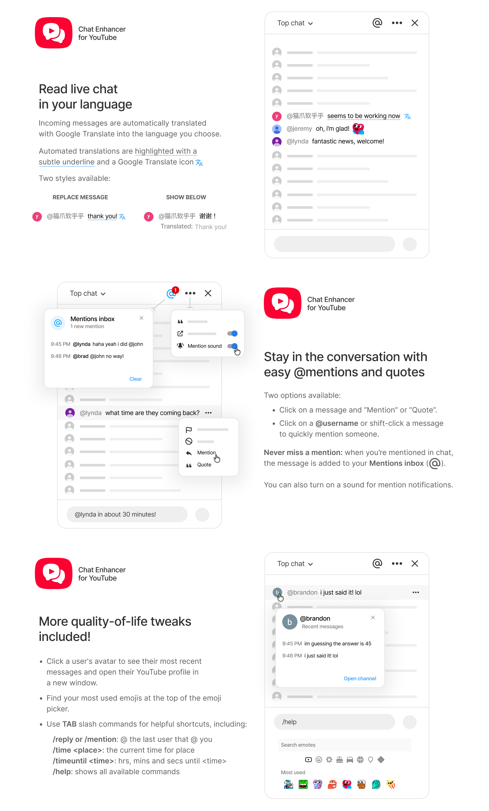

<p>
  
</p>

# Chat Enhancer for YouTube

<p>
  <a href="https://chromewebstore.google.com/detail/pkhaaipeppfpakofgpdpcpkflangpghf"></a>
  <a href="https://addons.mozilla.org/firefox/addon/chat-enhancer-for-youtube/"></a>
  
  <a href="https://github.com/chat-enhancer-yt/youtube-chat-qol/actions/workflows/ci.yml"></a>
  
  
  <a href="LICENSE"></a>
</p>

A lightweight Manifest V3 browser extension that adds native-feeling quality-of-life tools to YouTube livestream chat.

Not affiliated with YouTube or Google.

## Features

### Translation

- Translate live chat messages, with `Off` as the default.
- Choose whether translations replace the original message or appear below it.

### Mention and quote

- Add `Mention` and `Quote` actions to YouTube's existing message menu.
- Click an author name to mention them, or Alt/Option-click it to quote that message.

### Chat context

- Click an avatar to see that user's recent messages and open their channel.
- Keep a local inbox for messages that mention your handle or match your keywords.
- Optionally play a subtle sound when chat saves a new inbox message.

### Chat comfort

- Add a local most-used row to YouTube's emoji picker.
- Complete chat slash commands for mentions, quotes, repeated messages, time helpers, and extension settings.
- Keep chat at the live edge after tab switches so inbox alerts and translations can keep up.
- Toggle translation and inbox sound from YouTube's live chat settings menu, with deeper options in the extension popup.

## Chat Commands

<!-- chat-commands:start -->

Type commands in the YouTube chat input, then press `Tab`. Commands do not send automatically. Unknown slash commands are left alone.

Mention, reply, time, and time-until commands can also be expanded inline, such as `starts in /timeuntil 7pm`.

### Text commands

- `/mention` or `/reply` + `Tab`: insert a mention for the author of the newest inbox message.
- `/quote` + `Tab`: quote the newest inbox message.
- `/again` or `/repeat` + `Tab`: restore your last sent message.
- `/time utc` + `Tab`: insert the current time for a supported timezone or city.
  Supported aliases: `utc`, `tokyo`, `jst`, `seoul`, `kst`, `london`, `paris`, `madrid`, `newyork`, `nyc`, `et`, `eastern`, `losangeles`, `la`, `pt`, and `pacific`.
- `/timeuntil 7:45pm` + `Tab`: insert the time remaining until the next matching local time.
  Accepted formats: `7`, `7am`, `7 am`, `7:45am`, `7:45 am`, `19`, `19:00`, `19:00:30`, and `7:45:30 pm`.
- `/help` + `Tab`: show available chat commands.

### Setting commands

- `/settranslateto english` or `/settranslateto off` + `Tab`: set the translation language, or turn translation off.
- `/settranslationdisplay replace` or `/settranslationdisplay below` + `Tab`: choose whether translations replace messages or show below them.
- `/setquotelength 120` + `Tab`: set quote length to 80, 120, 180, or 240.
- `/setsound on` or `/setsound off` + `Tab`: turn inbox sounds on or off.
- `/setopenchannelsinpopup on` or `/setopenchannelsinpopup off` + `Tab`: open channels in popup windows or open them normally.

Use `//` to send a literal slash command, such as `//quote`.

<!-- chat-commands:end -->

## Screenshots



## Development

Install dependencies:

```sh
npm install
```

Build the extension:

```sh
npm run build
```

Load it in Chrome, Edge, Brave, Vivaldi, Arc, or another Chromium browser:

1. Open `chrome://extensions`.
2. Enable Developer mode.
3. Click `Load unpacked`.
4. Select this repository folder or `dist/extension-chrome`.

After source changes, run `npm run build` again and reload the unpacked extension.

For Firefox 140+ development, build the Firefox package and load `dist/extension-firefox` from `about:debugging#/runtime/this-firefox`:

```sh
npm run build:firefox
```

## Scripts

- `npm run typecheck` checks TypeScript.
- `npm run lint` runs ESLint.
- `npm run build` writes the Chromium unpacked extension to `dist/extension-chrome`.
- `npm run build:all` writes Chrome, Edge, and Firefox unpacked extension folders.
- `npm run verify` runs typecheck, lint, and all browser builds.
- `npm run icons` regenerates PNG icons from `assets/icons/icon.svg`.
- `npm run screenshots` regenerates README, high-resolution docs, and Chrome Web Store screenshots from the three docs screenshot exports.
- `npm run zip` builds and writes the default Chrome Web Store archive and tracked source archive to `dist/release/`.
- `npm run zip:all` builds Chrome, Edge, Firefox, and tracked source release archives.

## Release

1. Update `version` in `package.json`.
2. Run `npm run verify`.
3. Run `npm run zip:all`.
4. Upload the generated browser-specific zip from `dist/release/` to the relevant store. Use the `source` zip for Firefox source-code review when needed.

## License

MIT. See [LICENSE](LICENSE).

## Project Layout

- `src/content/` wires features into YouTube live chat.
- `src/features/` contains chat actions, translation, emoji, profile, inbox, and sound features.
- `src/youtube/` contains YouTube DOM adapters and selectors.
- `src/shared/` contains shared options, language data, state, and helpers.
- `src/background/` contains the translation service worker.
- `src/popup/` contains the extension action popup.
- `scripts/` contains build, icon, and release packaging scripts.

See [PRIVACY.md](PRIVACY.md) for the current data-use disclosure.
