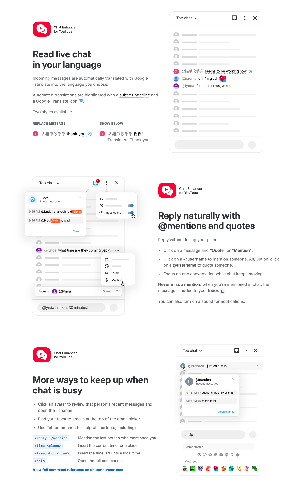

<p>
  
</p>

# Chat Enhancer for YouTube

<p>
  <a href="https://www.chatenhancer.com/chrome"></a>
  <a href="https://www.chatenhancer.com/firefox"></a>
  
  <a href="https://github.com/chat-enhancer-yt/youtube-chat-qol/actions/workflows/verify.yml"></a>
  
  
  <a href="LICENSE"></a>
</p>

Suite of enhancements that make YouTube live chat easier to follow and participate in.

Not affiliated with YouTube or Google.

[Website](https://www.chatenhancer.com) · [Chrome Web Store](https://www.chatenhancer.com/chrome) · [Firefox Add-ons](https://www.chatenhancer.com/firefox)

## Features

###  &nbsp;Translation

- Translate live chat messages, with translation off by default.
- Choose whether translations replace the original message or appear below it.
- Translate the message you're typing before sending it, while keeping mentions and emojis intact.

###  &nbsp;Reply and context

- Mention or quote messages from YouTube's existing message menu.
- Click an author name to mention them.
- Alt/Option-click an author name to quote their message.
- Use Focus mode to keep one conversation visible while you reply.
- Recover unsent drafts after refreshing the same stream.
- Click an avatar to see that user's recent messages and open their channel.

###  &nbsp;Inbox

- Keep a local inbox for messages that mention your handle or match watched keywords/phrases.
- Highlight mentions and watched keywords in chat and in the inbox.
- Jump back to saved messages while they are still visible in chat.
- Optionally play a subtle sound and show tab alerts for new inbox messages.

###  &nbsp;Emoji and commands

- Reuse your most-used emojis from a local row in the emoji picker.
- Use Tab-expanded chat commands and autocomplete for mentions, quotes, time helpers, translations, inbox watches, and settings.

###  &nbsp;Popup and status

- See whether the extension is active in the current tab or other open live chat tabs.
- Manage extension settings and clear local extension data from the popup.

###  &nbsp;Privacy

- The extension does not replace YouTube chat.
- The extension does not run analytics.
- The extension does not send data to an extension-owned server.
- When a translation feature is enabled, incoming message text or draft text you choose to translate is sent to Google Translate so it can be translated.

## Screenshots



## Development

Install dependencies:

```sh
npm install
```

Build the extension:

```sh
npm run build
```

Load it in Chrome, Edge, Brave, Vivaldi, Arc, or another Chromium browser:

1. Open `chrome://extensions`.
2. Enable Developer mode.
3. Click `Load unpacked`.
4. Select `dist/extension-chrome`.

After source changes, run `npm run build` again and reload the unpacked extension.

For Firefox 140+ development, build the Firefox package and load `dist/extension-firefox` from `about:debugging#/runtime/this-firefox`:

```sh
npm run build:firefox
```

## Scripts

- `npm run typecheck` checks TypeScript.
- `npm run lint` runs ESLint.
- `npm run check` runs typecheck and lint.
- `npm run test` runs the Vitest unit tests.
- `npm run verify` runs `check`, unit tests, the full extension build, localized docs build, mock browser tests, and logged-out live browser smoke tests.
- `npm run docs:build` regenerates localized docs and the sitemap when docs change.
- `npm run docs:screenshots` regenerates README/site showcase images and localized store screenshots when needed.
- `npm run build` writes Chrome, Edge, and Firefox unpacked extension folders.
- `npm run build:chrome`, `npm run build:edge`, and `npm run build:firefox` write one browser's unpacked extension folder.
- `npm run zip` runs `verify`, then writes Chrome, Edge, Firefox, and tracked source release archives to `dist/release/`.

## Release

1. Update `version` in `package.json`.
2. Run `npm run verify`.
3. Commit the version bump and create a tag such as `v0.7.6`.
4. Push the commit and tag.

The release workflow builds Chrome, Edge, Firefox, and source archives, then attaches them to a GitHub Release.
Store submission only runs for exact `vX.Y.Z` tags that match the `package.json` version.

Store submission is automatic on tags when these repository settings are present:

- Repository variables:
  - `CHROME_WEBSTORE_EXTENSION_ID`
  - `CHROME_WEBSTORE_PUBLISHER_ID`
  - `FIREFOX_AMO_ADDON_ID`
  - optional `FIREFOX_AMO_APPROVAL_NOTES`
  - optional `FIREFOX_AMO_RELEASE_NOTES`
- Repository secrets:
  - `CHROME_WEBSTORE_SERVICE_ACCOUNT_JSON`
  - `FIREFOX_AMO_API_KEY`
  - `FIREFOX_AMO_API_SECRET`

If those settings are missing, the workflow still produces release zips and skips store submission.

## License

GPL-3.0-or-later. See [LICENSE](LICENSE).

Third-party icon and font notices are listed in [THIRD_PARTY_NOTICES.md](THIRD_PARTY_NOTICES.md).

The `Chat Enhancer for YouTube` name, logo, and store listing assets are not licensed for use in a way that suggests an official release or endorsement.

## Project layout

- `src/content/` wires features into YouTube live chat.
- `src/features/` contains chat actions, drafts, commands, translation, emoji, focus mode, profile cards, inbox, and sound features.
- `src/youtube/` contains YouTube DOM adapters and selectors.
- `src/shared/` contains shared options, language data, state, and helpers.
- `src/background/` contains the translation bridge, toolbar status, and active-chat keepalive service worker modules.
- `src/popup/` contains the extension action popup.
- `scripts/` contains build, icon, and release packaging scripts.

See [PRIVACY.md](PRIVACY.md) for the current data-use disclosure.
