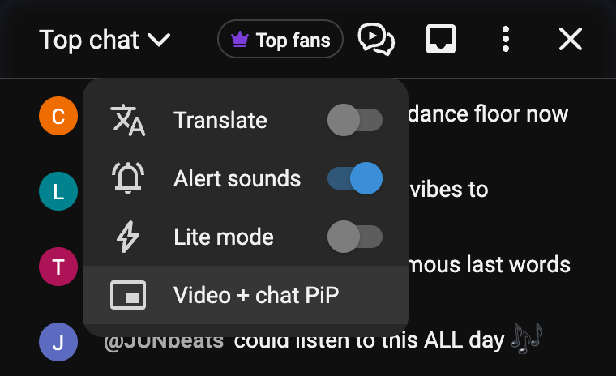
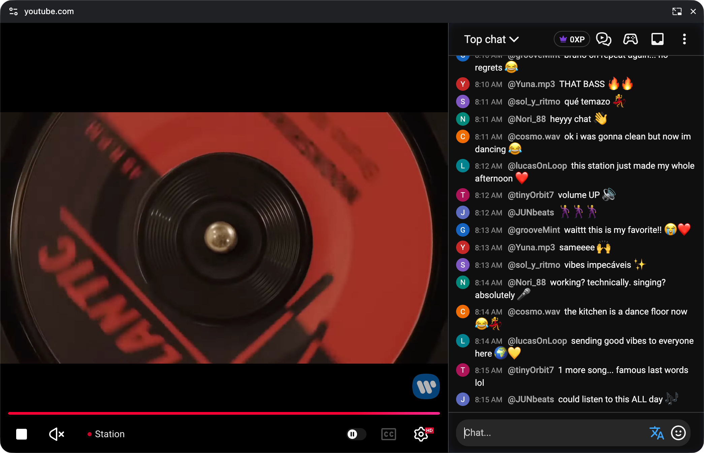
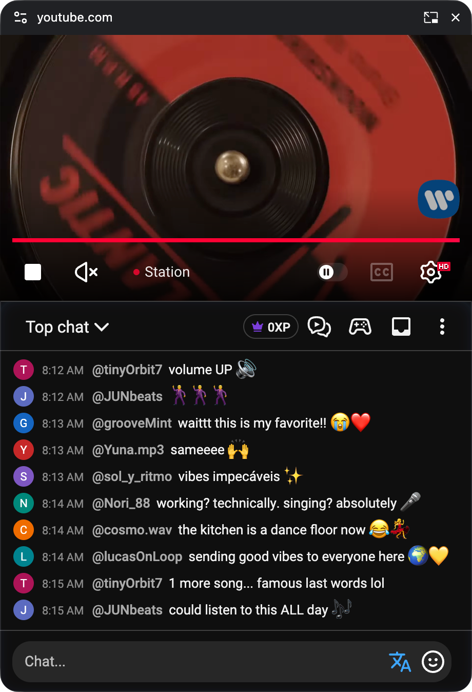

Schau einen Stream und verfolge die Unterhaltung, während du surfst, arbeitest oder Notizen machst. **Video + Chat PiP** bringt den YouTube-Player und den interaktiven Livechat in ein Fenster, das über deinen anderen Fenstern bleibt.

Verschiebe es in eine passende Ecke und schau weiter. Du kannst im Chat lesen und antworten, ohne zum YouTube-Tab zurückzuwechseln.

## Über das Chatmenü öffnen

:::media-left

 {shadow=smooth}

Auf einer YouTube-Videoseite mit geöffnetem Livechat:

1. Klicke oben im Chat auf das **Chat Enhancer**-Symbol.
2. Wähle **Video + Chat PiP**.

:::

## Ein kleines Fenster mit Platz für beides

Das Fenster öffnet sich mit dem Video über einem kompakten Chat. Passe seine Größe an deinen Bildschirm an. Wenn du es breiter ziehst, stehen Video und Chat nebeneinander.

 {shadow=smooth}

:::media-right

### Vertraute Steuerelemente direkt dabei

Pausiere das Video, ändere Lautstärke oder Qualität, spule eine Aufzeichnung durch oder schalte verfügbare Untertitel ein. Die YouTube-Steuerelemente bleiben beim Video und deine Chat Enhancer-Werkzeuge beim Chat.

Im schwebenden Fenster verwendet der Chat engere Abstände. Deine gewohnte Einstellung für die Chatdichte bleibt für die Rückkehr gespeichert.

:::

## Mit einem Klick zurück zum Tab

Schließe das schwebende Fenster oder wähle im ursprünglichen Video- oder Chatbereich **Zurück zum Tab**. Beide kehren an ihren Platz auf YouTube zurück. Dein ungesendeter Chatentwurf kommt mit.

Lass den ursprünglichen YouTube-Tab geöffnet, solange du PiP nutzt. Wenn du den Stream verlässt, endet die schwebende Sitzung.

## Unterstützte Browser

Video + Chat PiP ist in unterstützten Desktopversionen von **Chrome, Edge und Firefox** verfügbar. Safari unterstützt das gemeinsame Fenster für Video und Chat derzeit nicht; dort bleibt die Option ausgeblendet.

Hast du eine Idee, die das gemeinsame Zuschauen verbessern würde? Schreib uns an [hello@chatenhancer.com](mailto:hello@chatenhancer.com).
