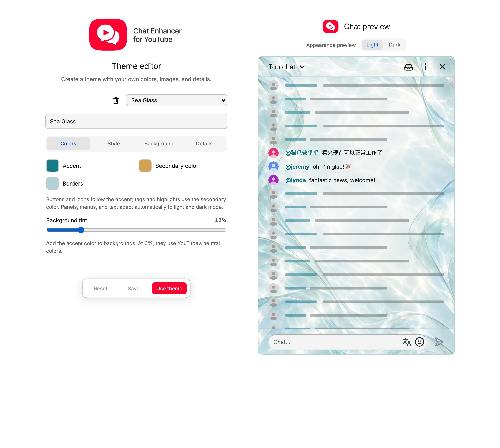
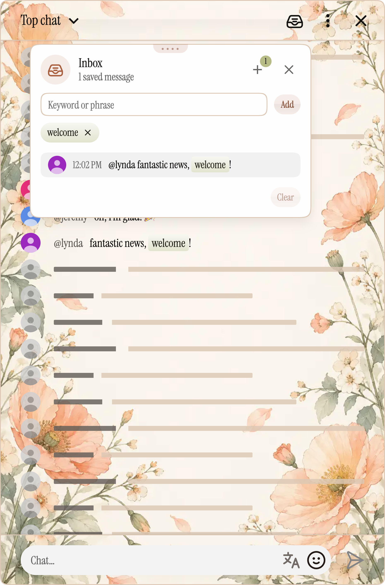
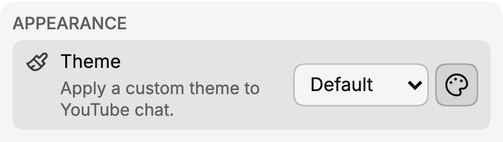

Aero hat dem YouTube-Chat einen neuen Look gegeben. Mit dem neuen **Theme-Editor** gestaltest du jetzt deinen eigenen – von einer dezenten Farbänderung bis zu einem ganz persönlichen Stil.

Wähle eine Farbpalette und eine Schrift und füge Hintergründe für die Kopfzeile, den Nachrichtenbereich oder den Eingabebereich hinzu. Das Theme gilt auch für die Chatmenüs und die Panels von Chat Enhancer, damit die Details zusammenpassen.

## Beginne mit einer Farbpalette

Du musst nicht für jeden Button und jedes Symbol eine eigene Farbe wählen. Lege eine **Akzentfarbe**, eine **Sekundärfarbe** und eine **Rahmenfarbe** fest. Der Editor färbt damit die kleinen Details, etwa Buttons, Schnellschalter, Panelsymbole und Nachrichtenhervorhebungen.

Mit **Hintergrundtönung** bestimmst du, wie stark die Akzentfarbe in den Hintergründen erscheint. Ein niedriger Wert hält den Chat neutral, ein höherer verleiht ihm mehr Farbe.

## Wähle eine Oberfläche

:::media-left

{size=large}

Die Oberfläche verändert den Eindruck der Flächen:

- **Flach** hält sie schlicht und ohne Reflexionen.
- **Glänzend** verleiht Bedienelementen Glanz und undurchsichtigen Panels einen dezenten Lichtreflex.
- **Glas** verwendet sanfte Reflexionen und durchscheinende Panels mit unscharfem Hintergrund.

Öffne den Posteingang oder ein Profil in der Vorschau, um den Unterschied zu sehen. Auch Ecken, Schatten und die Stärke des Glanzes lassen sich anpassen. Die Schrift gilt für das gesamte Theme. Zur Auswahl stehen vertraute, schlichte Stile ebenso wie verspielte, gotische und Pixelschriften.

:::

## Verwende deine eigenen Bilder

Kopfzeile, Nachrichtenbereich und Eingabebereich haben jeweils eigene Hintergrundeinstellungen. Verwende eine einfarbige Fläche, einen Verlauf oder lade ein Bild hoch – auch animierte GIFs sind möglich. Mit Position und Zoom legst du den sichtbaren Ausschnitt fest.

Wechsle beim Bearbeiten zwischen **Hell** und **Dunkel**. Die Palette passt sich automatisch an. Für einen anderen Bildaufbau kannst du zusätzlich ein Bild für den dunklen Modus hinterlegen. Text über Bildern erhält automatisch passenden Kontrast; bei Bedarf kannst du helle oder dunkle Schrift festlegen.

## Probiere es vor dem Anwenden aus

Die Vorschau zeigt einen Beispielchat im Editor. Wenn du dort Farben oder Hintergründe ausprobierst, ändern sich deine geöffneten YouTube-Tabs nicht.

Mit **Strg+Z** oder **⌘Z** machst du eine Änderung rückgängig. **Zurücksetzen** stellt die zuletzt gespeicherte Version des Themes wieder her – bei einem neuen Theme die Standardwerte.

Wenn dir das Ergebnis gefällt:

- **Speichern** sichert deine Arbeit und lässt das aktuelle Aussehen des Chats unverändert.
- **Speichern und verwenden** speichert das Theme und legt es als aktuelles Theme fest.

Wenn du den Namen eines gespeicherten Themes änderst, entsteht ein neues Theme. So kannst du einfach mehrere Varianten behalten. Eigene Themes und ihre Bilder werden lokal in deinem Browserprofil gespeichert.

## Öffne den Theme-Editor

Öffne das Erweiterungs-Popup, gehe zu **Einstellungen** und klicke auf den **Palettenbutton neben der Auswahlliste Design**. Beginne mit einem neuen Theme oder wähle ein bereits gespeichertes.

Du kannst auch das vorinstallierte Theme **Aero** als Ausgangspunkt verwenden und deine Version unter einem neuen Namen speichern.

Eine Lieblingsfarbe reicht für den Anfang. Den Rest kannst du in der Vorschau gestalten.
