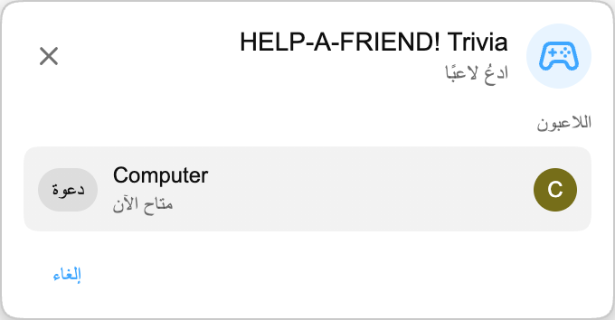

:::media-right

{shadow=smooth;rotate=-8deg}

بدلًا من لوحة أسئلة تقليدية، تسير *HELP-A-FRIEND! Trivia* كأنها دردشة جماعية صغيرة. يبدو أن أحد أصدقائك لم يكن منتبهًا للبث، والآن يحتاج إلى مساعدتك. هل تتذكر ما حدث؟

الإجابات الصحيحة تحصل على تفاعل 🏆.

أما الإجابات الخاطئة، فسيتم الحكم عليها *بلطف*.

:::

## طريقة اللعب

ابدأ مباراة Playground من إعادة تشغيل على YouTube، وادعُ لاعبًا آخر، وانتظر بضع ثوانٍ حتى تُجهّز الأسئلة.

بعد بدء اللعبة، يسألك "صديقك" عن الإعادة. تظهر أربع إجابات محتملة، ويختار اللاعبان قبل انتهاء الوقت. أجب بسرعة؛ صديقك ليس صبورًا.

## مصممة لإعادات التشغيل

تُنشأ كل مباراة من نص الإعادة التي تشاهدها، لذلك يمكن للعبة أن تسأل عن أشياء حدثت فعلًا في ذلك البث: مفاجآت، جوائز، نكات، خروج عن الموضوع، وكل ما وصل إلى الفيديو.

:::media-left

## جرّبها

*HELP-A-FRIEND! Trivia* جزء من Playground، الذي لا يزال اختياريًا. فعّل Playground من إعدادات الإضافة، وافتح إعادة تشغيل تتضمن دردشة مباشرة، وابدأ مباراة من لوحة الألعاب. ابحث عن أيقونة وحدة التحكم في الدردشة.

متاحة حاليًا باللغة الإنجليزية.

:::
