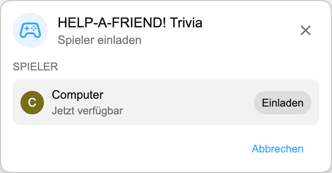

:::media-right

{shadow=smooth;rotate=-8deg}

Statt auf einem klassischen Quizbrett spielt sich *HELP-A-FRIEND! Trivia* wie ein kleiner Gruppenchat ab. Einer deiner Freunde hat beim Stream ganz offensichtlich nicht aufgepasst und braucht jetzt Hilfe. Weißt du noch, was passiert ist?

Richtige Antworten bekommen eine 🏆-Reaktion.

Falsche Antworten werden *höflich* beurteilt.

:::

## So funktioniert es

Starte ein Playground-Match aus einem YouTube-Replay, lade einen weiteren Spieler ein und warte ein paar Sekunden, während die Fragen vorbereitet werden.

Sobald das Spiel beginnt, stellt dein "Freund" Fragen zum Replay. Es erscheinen vier mögliche Antworten, und beide Spieler wählen, bevor die Zeit abläuft. Antworte schnell. Dein Kumpel ist nicht gerade geduldig.

## Für Replays gebaut

Jedes Match wird aus dem Transkript des Replays generiert, das du gerade ansiehst. So kann das Spiel nach Momenten fragen, die in diesem Stream wirklich passiert sind: Enthüllungen, Auszeichnungen, Witze, Abschweifungen und alles andere, was im Video gelandet ist.

:::media-left

## Probier es aus

*HELP-A-FRIEND! Trivia* ist Teil von Playground, das weiterhin optional ist. Aktiviere Playground in den Erweiterungseinstellungen, öffne ein Replay mit Livechat und starte ein Match im Spiele-Panel. Halte im Chat nach dem Controller-Symbol Ausschau.

Vorerst auf Englisch verfügbar.

:::
