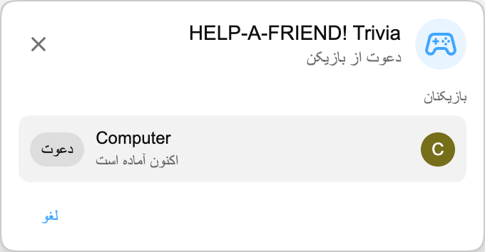

:::media-right

{shadow=smooth;rotate=-8deg}

به جای یک صفحه آزمون معمولی، *HELP-A-FRIEND! Trivia* مثل یک چت گروهی کوچک پیش می‌رود. یکی از دوستانتان ظاهراً حواسش به پخش نبوده و حالا کمک می‌خواهد. یادتان هست چه اتفاقی افتاد؟

پاسخ‌های درست واکنش 🏆 می‌گیرند.

پاسخ‌های اشتباه هم *مودبانه* قضاوت می‌شوند.

:::

## چطور کار می‌کند

از یک بازپخش YouTube یک مسابقه Playground شروع کنید، بازیکن دیگری را دعوت کنید و چند ثانیه صبر کنید تا پرسش‌ها آماده شوند.

وقتی بازی شروع می‌شود، «دوست» شما درباره بازپخش سؤال می‌پرسد. چهار پاسخ احتمالی ظاهر می‌شود و هر دو بازیکن باید پیش از تمام شدن زمان انتخاب کنند. سریع جواب بدهید؛ رفیقتان صبور نیست.

## ساخته‌شده برای بازپخش‌ها

هر مسابقه از متن بازپخشی ساخته می‌شود که در حال تماشای آن هستید، پس بازی می‌تواند درباره لحظه‌هایی بپرسد که واقعاً در همان پخش رخ داده‌اند: رونمایی‌ها، جایزه‌ها، شوخی‌ها، حاشیه‌ها و هر چیز دیگری که وارد ویدیو شده است.

:::media-left

## امتحانش کنید

*HELP-A-FRIEND! Trivia* بخشی از Playground است که هنوز اختیاری است. Playground را از تنظیمات افزونه فعال کنید، یک بازپخش دارای چت زنده را باز کنید و از پنل بازی‌ها یک مسابقه شروع کنید. در چت دنبال آیکون کنترلر بگردید.

فعلاً به زبان انگلیسی در دسترس است.

:::
