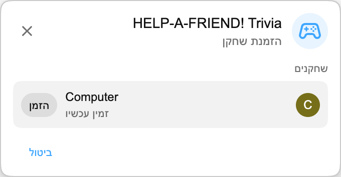

:::media-right

{shadow=smooth;rotate=-8deg}

במקום לוח חידון רגיל, *HELP-A-FRIEND! Trivia* מתנהל כמו צ'אט קבוצתי קטן. אחד החברים שלכם כנראה לא ממש הקשיב לשידור, ועכשיו הוא צריך עזרה. אתם זוכרים מה קרה?

תשובות נכונות מקבלות את התגובה 🏆.

תשובות שגויות נשפטות *בנימוס*.

:::

## איך זה עובד

מתחילים משחק Playground מתוך שידור חוזר ב-YouTube, מזמינים שחקן נוסף וממתינים כמה שניות עד שהשאלות מוכנות.

כשהמשחק מתחיל, ה"חבר" שלכם שואל על השידור החוזר. מופיעות ארבע תשובות אפשריות, ושני השחקנים בוחרים לפני שהזמן נגמר. ענו מהר; החבר שלכם לא סבלני.

## בנוי לשידורים חוזרים

כל משחק נוצר מתוך התמלול של השידור החוזר שאתם צופים בו, כך שהוא יכול לשאול על רגעים שבאמת קרו באותו שידור: חשיפות, פרסים, בדיחות, סטיות מהנושא וכל דבר אחר שנכנס לסרטון.

:::media-left

## נסו את זה

*HELP-A-FRIEND! Trivia* הוא חלק מ-Playground, שעדיין נשאר אופציונלי. הפעילו את Playground מהגדרות התוסף, פתחו שידור חוזר עם צ'אט חי והתחילו משחק מלוח המשחקים. חפשו את סמל הבקר בצ'אט.

זמין באנגלית לעת עתה.

:::
