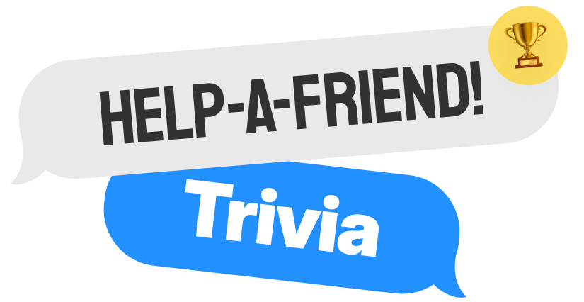
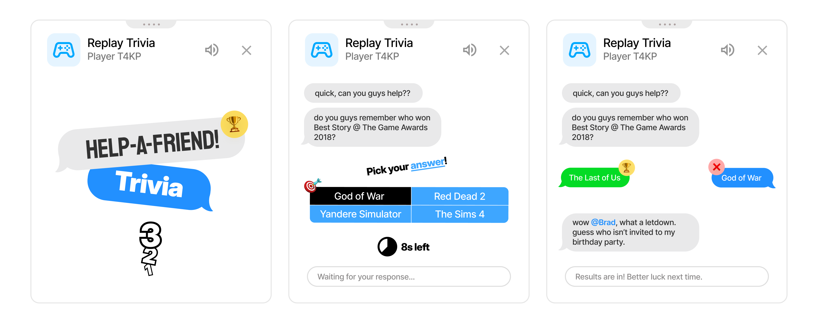

משחק ה-Playground השני כבר כאן: **HELP-A-FRIEND! Trivia**

:::media-right

{shadow=smooth}

במקום לוח חידון, *HELP-A-FRIEND! Trivia* מתנהל כמו צ'אט קבוצתי קטן. אחד החברים שלך בבירור לא הקשיב לשידור ועכשיו צריך עזרה... יש לך את הידע?

תשובות נכונות מקבלות את התגובה 🏆.

תשובות שגויות נשפטות *בנימוס*.

:::

## איך זה עובד

מתחילים משחק Playground מתוך שידור חוזר ב-YouTube (שידור חי שכבר הסתיים), מזמינים שחקן נוסף, וממתינים כמה שניות בזמן שהשאלות מוכנות.

כשהמשחק מתחיל, ה"חבר" שלך שואל על השידור החוזר, מופיעות ארבע תשובות אפשריות, ושני השחקנים בוחרים לפני שהזמן נגמר. ענה מהר. החבר שלך לא סבלני.

## בנוי לשידורים חוזרים

כל משחק נוצר מתוך התמלול של השידור החוזר שבו אתה צופה, כך שהמשחק יכול לשאול על רגעים שבאמת קרו באותו שידור: חשיפות, פרסים, בדיחות, סטיות מהנושא וכל דבר אחר שנכנס לסרטון.

## נסה את זה!

*HELP-A-FRIEND! Trivia* הוא חלק מ-Playground, שעדיין נשאר אופציונלי. הפעל את Playground מהגדרות התוסף, פתח שידור חוזר עם צ'אט חי, והתחל משחק מלוח המשחקים. חפש את סמל הבקר בצ'אט.

זמין באנגלית לעת עתה.

{align=center}
