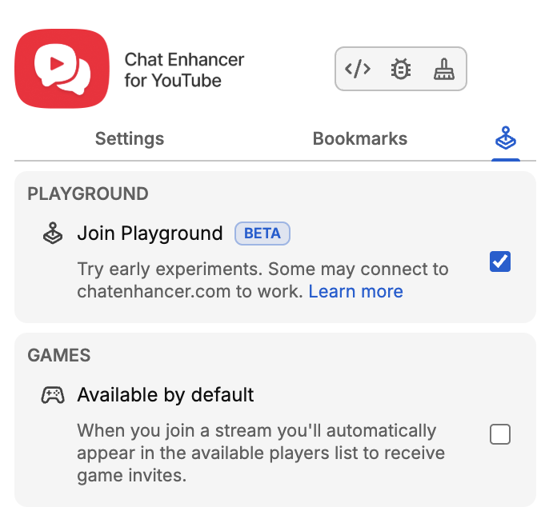

दूसरा Playground गेम आ गया है: **HELP-A-FRIEND! Trivia**

:::media-right

{shadow=smooth;rotate=-8deg}

क्विज बोर्ड के बजाय, *HELP-A-FRIEND! Trivia* एक छोटे ग्रुप चैट जैसा चलता है। तुम्हारा एक दोस्त साफ तौर पर स्ट्रीम पर ध्यान नहीं दे रहा था और अब उसे मदद चाहिए... क्या तुम्हें जवाब पता हैं?

सही जवाबों को 🏆 प्रतिक्रिया मिलती है।

गलत जवाबों को *विनम्रता से* जज किया जाता है।

:::

## यह कैसे काम करता है

YouTube रीप्ले (एक लाइव स्ट्रीम जो खत्म हो चुकी है) से Playground मैच शुरू करो, दूसरे खिलाड़ी को आमंत्रित करो, और सवाल तैयार होने तक कुछ सेकंड इंतज़ार करो।

गेम शुरू होते ही तुम्हारा “दोस्त” रीप्ले के बारे में पूछता है, चार संभावित जवाब दिखते हैं, और समय खत्म होने से पहले दोनों खिलाड़ी चुनते हैं। जल्दी जवाब दो। तुम्हारा दोस्त धैर्यवान नहीं है।

## रीप्ले के लिए बनाया गया

हर मैच उस रीप्ले की ट्रांसक्रिप्ट से बनाया जाता है जिसे तुम देख रहे हो, इसलिए गेम उस स्ट्रीम में सचमुच हुए पलों के बारे में पूछ सकता है: खुलासे, पुरस्कार, मज़ाक, भटकती बातें, और वीडियो में आई बाकी हर चीज़।

:::media-left

## इसे आज़माएँ!

*HELP-A-FRIEND! Trivia* Playground का हिस्सा है, जो अभी भी वैकल्पिक है। एक्सटेंशन सेटिंग्स से Playground चालू करें, लाइव चैट वाला रीप्ले खोलें, और Games पैनल से मैच शुरू करें। चैट में कंट्रोलर आइकन देखें।

अभी के लिए अंग्रेज़ी में उपलब्ध है।

:::
