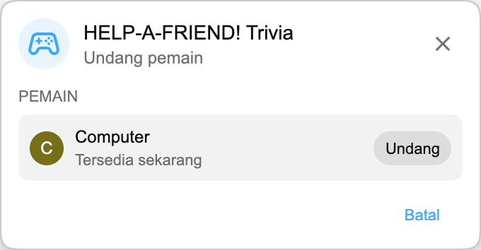

:::media-right

{shadow=smooth;rotate=-8deg}

Alih-alih papan kuis, *HELP-A-FRIEND! Trivia* terasa seperti chat grup kecil. Seorang teman jelas tidak memperhatikan stream dan sekarang butuh bantuan. Masih ingat apa yang terjadi?

Jawaban benar mendapat reaksi 🏆.

Jawaban salah akan dinilai *dengan sopan*, tentu saja.

:::

## Cara kerjanya

Mulai pertandingan Playground dari replay YouTube, undang pemain lain, lalu tunggu beberapa detik sementara pertanyaan disiapkan.

Begitu game dimulai, “teman” Anda akan bertanya tentang replay. Empat pilihan jawaban muncul, dan kedua pemain harus memilih sebelum waktu habis. Jawab cepat. Teman Anda tidak terlalu sabar.

## Dibuat untuk replay

Setiap pertandingan dibuat dari transkrip replay yang sedang Anda tonton, jadi game dapat bertanya tentang momen yang benar-benar terjadi di stream itu: pengungkapan, penghargaan, lelucon, obrolan yang melenceng, dan apa pun yang masuk ke video.

:::media-left

## Coba sekarang

*HELP-A-FRIEND! Trivia* adalah bagian dari Playground, yang masih bersifat opt-in. Aktifkan Playground dari pengaturan ekstensi, buka replay dengan live chat, lalu mulai pertandingan dari panel Game. Cari ikon controller di chat.

Tersedia dalam bahasa Inggris untuk saat ini.

:::
