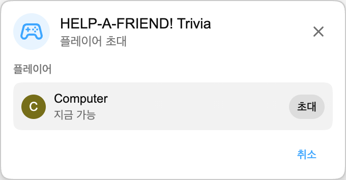

:::media-right

{shadow=smooth;rotate=-8deg}

*HELP-A-FRIEND! Trivia*는 퀴즈 보드 대신 작은 그룹 채팅처럼 진행됩니다. 친구 한 명이 분명 스트림을 제대로 보지 않았고, 이제 도움이 필요합니다. 무슨 일이 있었는지 기억하나요?

정답에는 🏆 반응이 붙습니다.

오답에는 *정중한* 한마디가 따라옵니다.

:::

## 작동 방식

YouTube 다시보기에서 Playground 매치를 시작하고, 다른 플레이어를 초대한 뒤, 질문이 준비되는 동안 몇 초 기다립니다.

게임이 시작되면 친구가 다시보기에 대해 질문합니다. 네 가지 답이 나타나고, 두 플레이어는 시간이 끝나기 전에 하나를 선택해야 합니다. 빠르게 답하세요. 친구는 그렇게 인내심이 많지 않습니다.

## 다시보기를 위해 제작

각 매치는 보고 있는 다시보기의 스크립트에서 생성됩니다. 그래서 그 스트림에서 실제로 일어난 일을 물어볼 수 있습니다. 공개 장면, 시상, 농담, 딴길로 샌 이야기, 영상에 남은 자잘한 순간까지 모두 소재가 됩니다.

:::media-left

## 플레이해 보세요

*HELP-A-FRIEND! Trivia*는 Playground의 일부이며, 계속 선택 참여 기능입니다. 확장 프로그램 설정에서 Playground를 켜고, 라이브 채팅이 있는 다시보기를 연 다음, 게임 패널에서 매치를 시작하세요. 채팅에 보이는 컨트롤러 아이콘이 표시입니다.

현재는 영어로 제공됩니다.

:::
