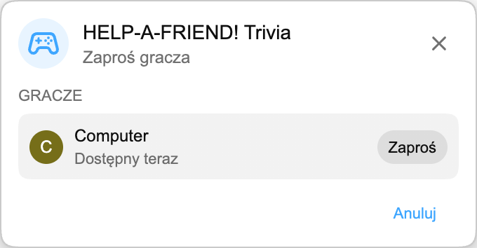

:::media-right

{shadow=smooth;rotate=-8deg}

Zamiast klasycznej planszy quizowej *HELP-A-FRIEND! Trivia* rozgrywa się jak mały czat grupowy. Jeden z twoich znajomych wyraźnie nie uważał podczas streamu i teraz potrzebuje pomocy. Pamiętasz, co się stało?

Poprawne odpowiedzi dostają reakcję 🏆.

Błędne odpowiedzi są oceniane *uprzejmie*.

:::

## Jak to działa

Rozpocznij mecz Playground z powtórki YouTube, zaproś drugiego gracza i poczekaj kilka sekund, aż pytania będą gotowe.

Gdy gra się zacznie, twój "znajomy" pyta o powtórkę. Pojawiają się cztery możliwe odpowiedzi, a obaj gracze wybierają przed końcem czasu. Odpowiadaj szybko. Twój kumpel nie jest cierpliwy.

## Stworzone dla powtórek

Każdy mecz jest generowany z transkrypcji oglądanej powtórki, więc gra może pytać o momenty, które naprawdę wydarzyły się w tym streamie: ujawnienia, nagrody, żarty, dygresje i wszystko inne, co trafiło do filmu.

:::media-left

## Wypróbuj

*HELP-A-FRIEND! Trivia* jest częścią Playground, który nadal jest opcjonalny. Włącz Playground w ustawieniach rozszerzenia, otwórz powtórkę z czatem na żywo i rozpocznij mecz z panelu Gry. Wypatruj ikony kontrolera na czacie.

Na razie dostępne po angielsku.

:::
