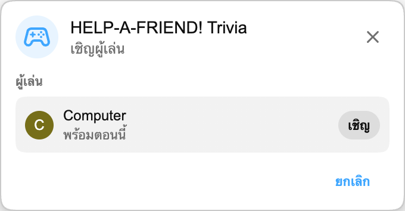

:::media-right

{shadow=smooth;rotate=-8deg}

แทนที่จะเป็นกระดานควิซ *HELP-A-FRIEND! Trivia* จะเล่นเหมือนแชทกลุ่มเล็ก ๆ เพื่อนคนหนึ่งของคุณไม่ได้ตั้งใจดูสตรีมเอาเสียเลย และตอนนี้ต้องการความช่วยเหลือ คุณจำได้ไหมว่าเกิดอะไรขึ้น?

คำตอบที่ถูกจะได้รับรีแอ็กชัน 🏆

คำตอบที่ผิดจะถูกตัดสินอย่าง *สุภาพ* แน่นอน

:::

## วิธีเล่น

เริ่มแมตช์ Playground จากวิดีโอเล่นซ้ำของ YouTube เชิญผู้เล่นอีกคน แล้วรอสักครู่ระหว่างที่ระบบเตรียมคำถาม

เมื่อเกมเริ่ม “เพื่อน” ของคุณจะถามเกี่ยวกับวิดีโอเล่นซ้ำ มีคำตอบให้เลือกสี่ข้อ และผู้เล่นทั้งสองต้องเลือกก่อนหมดเวลา รีบตอบให้เร็ว เพื่อนของคุณไม่ค่อยมีความอดทน

## สร้างมาเพื่อวิดีโอเล่นซ้ำ

แต่ละแมตช์สร้างจากข้อความถอดเสียงของวิดีโอเล่นซ้ำที่คุณกำลังดูอยู่ เกมจึงถามเกี่ยวกับช่วงเวลาที่เกิดขึ้นจริงในสตรีมนั้นได้ ไม่ว่าจะเป็นการเปิดเผย รางวัล มุกตลก เรื่องที่คุยออกนอกทาง หรืออะไรก็ตามที่อยู่ในวิดีโอ

:::media-left

## ลองเล่นเลย

*HELP-A-FRIEND! Trivia* เป็นส่วนหนึ่งของ Playground ซึ่งยังเป็นฟีเจอร์ที่ต้องเลือกเปิดเอง เปิดใช้ Playground จากการตั้งค่าส่วนขยาย เปิดวิดีโอเล่นซ้ำที่มีแชทสด แล้วเริ่มแมตช์จากแผงเกม มองหาไอคอนคอนโทรลเลอร์ในแชท

ตอนนี้มีให้เล่นเป็นภาษาอังกฤษก่อน

:::
