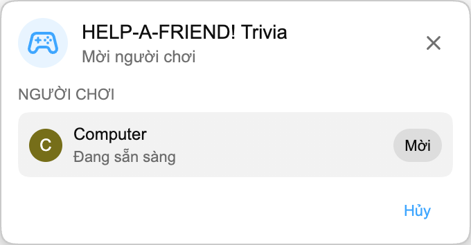

:::media-right

{shadow=smooth;rotate=-8deg}

Thay vì một bảng câu hỏi, *HELP-A-FRIEND! Trivia* diễn ra như một cuộc chat nhóm nhỏ. Một người bạn của bạn rõ ràng đã không chú ý đến stream và giờ cần được giúp. Bạn còn nhớ chuyện gì đã xảy ra không?

Câu trả lời đúng nhận phản ứng 🏆.

Câu trả lời sai sẽ bị đánh giá *một cách lịch sự*, tất nhiên.

:::

## Cách hoạt động

Bắt đầu một trận Playground từ bản phát lại YouTube, mời người chơi khác, rồi chờ vài giây trong khi các câu hỏi được chuẩn bị.

Khi trò chơi bắt đầu, “người bạn” của bạn hỏi về replay. Bốn đáp án xuất hiện, và cả hai người chơi phải chọn trước khi hết thời gian. Trả lời nhanh nhé. Bạn của bạn không kiên nhẫn đâu.

## Được tạo cho replays

Mỗi trận được tạo từ transcript của replay bạn đang xem, vì vậy trò chơi có thể hỏi về những khoảnh khắc thật sự đã xảy ra trong stream đó: tiết lộ, giải thưởng, câu đùa, những đoạn lạc đề và bất cứ điều gì khác xuất hiện trong video.

:::media-left

## Thử ngay

*HELP-A-FRIEND! Trivia* là một phần của Playground, hiện vẫn là tính năng opt-in. Bật Playground trong phần cài đặt tiện ích, mở một replay có live chat, rồi bắt đầu trận từ bảng Trò chơi. Tìm biểu tượng controller trong chat.

Hiện trò chơi có bằng tiếng Anh.

:::
