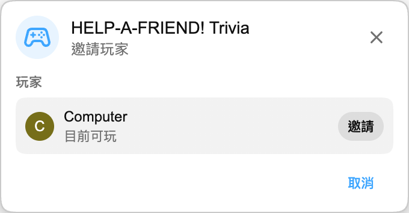

:::media-right

{shadow=smooth;rotate=-8deg}

*HELP-A-FRIEND! Trivia* 不是傳統答題板，而是像一段小型群組聊天。你的朋友顯然沒認真看直播，現在跑來求助：你還記得發生了什麼嗎？

答對會獲得 🏆 反應。

答錯也會被*禮貌地*吐槽。

:::

## 運作方式

在 YouTube 重播中開始一局 Playground，邀請另一位玩家，然後等幾秒鐘生成題目。

遊戲開始後，你的「朋友」會圍繞重播提問。四個選項會出現，兩位玩家都要在倒數結束前作答。動作快點，你這位朋友可沒什麼耐心。

## 為重播而生

每一局都會根據你正在觀看的重播字幕生成，所以遊戲問到的都是那場直播裡真實發生過的內容：揭曉、頒獎、玩笑、離題閒聊，以及其他被錄進影片裡的片段。

:::media-left

## 試試看

*HELP-A-FRIEND! Trivia* 是 Playground 的一部分，而 Playground 仍然需要主動開啟。在擴充功能設定中啟用 Playground，開啟帶有直播聊天室重播的影片，然後從遊戲面板開始一局。聊天室裡會出現手把圖示。

目前僅支援英文。

:::
