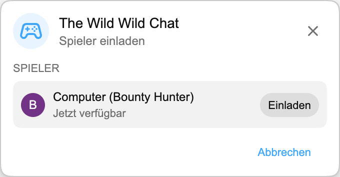

Das nächste Playground-Spiel zieht in den Livechat ein: **The Wild Wild Chat**.

Los geht es mit **Bounty Hunting**, einer schnellen Suche, bei der zwei Spieler denselben Stream-Chat beobachten und darum wetteifern, die passenden Nachrichten zu finden, bevor die Zeit abläuft.

:::media-right

{shadow=smooth;rotate=-6deg}

### So funktioniert es

Starte ein Playground-Match direkt aus dem Livechat, lade einen anderen Spieler ein und warte einen Moment, während die Runde vorbereitet wird.

Jede Runde hat sechs Kopfgelder, die auf Dingen basieren, die im Chat ganz von selbst passieren. Vielleicht musst du eine Nachricht mit 3+ Emojis finden, eine Nachricht in Großbuchstaben, eine Frage, eine Nutzererwähnung, einen verifizierten Chatter, einen Link, eine Zahl, eine wiederholte Formulierung oder eine Nachricht von einer besonders aktiven Person.

Beide Spieler drücken **Bereit**, dann startet ein kurzer 3-2-1-Countdown die eigentliche Jagd. Ab dann hast du 60 Sekunden.

:::

## Kopfgelder sichern

Die Steckbriefwand zeigt Sie gegen dich, den Live-Timer und die sechs offenen Kopfgelder. Jedes Kopfgeld hat einen Geldwert, eine Beschreibung und einen Stempel für **Offen** oder **Geholt**.

Um ein Kopfgeld zu holen, klickst du auf eine Livechat-Nachricht. Wenn die Nachricht zu einem offenen Kopfgeld passt, stempelt das Spiel es als geholt ab, addiert das Geld zu deinem Punktestand und setzt deinen Avatar in die Zeile.

Der erste gültige Treffer gewinnt dieses Kopfgeld. Sobald es geholt wurde, ist es für beide Spieler geschlossen. Also scanne weiter den Chat nach der nächsten Gelegenheit.

## Rundenende

Die Runde endet, wenn der Timer null erreicht oder alle sechs Kopfgelder geholt wurden.

Nach einem kurzen Bildschirm zum Rundenende zeigt **Das Register** das Endergebnis. Der Gewinner erscheint zuerst, danach der andere Spieler, jeweils mit Avatar, Rang, geholten Kopfgeldern und verdientem Geld. Wer am meisten Geld hat, gewinnt.

## Für Livechat gebaut

The Wild Wild Chat ist nur während eines Livechats verfügbar, weil das Spiel davon lebt, auf den Stream-Chat zu reagieren, während er passiert.

Es gibt außerdem einen Kompaktmodus. Wenn der große Steckbrief zu viel vom Chat verdeckt, verkleinere das Panel zu einer schmalen Zeile, die Timer und Punktestand sichtbar hält und den Feed leichter lesbar macht.

## Teil von Playground

Wie Schach und HELP-A-FRIEND! Trivia läuft The Wild Wild Chat in Playground. Es nutzt dasselbe Spiele-Panel, denselben Einladungsablauf und dasselbe schwebende Spielfenster. So bleibt es nah am YouTube-Chat.

:::media-left

Playground bleibt optional. Aktiviere **Playground beitreten** in den Erweiterungseinstellungen, öffne einen Livestream mit Chat und halte nach dem Spiele-Button Ausschau, sobald das Update da ist.

:::
