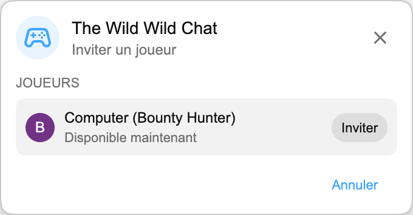

Le prochain jeu Playground arrive dans le chat en direct : **The Wild Wild Chat**.

Il commence avec **Bounty Hunting**, une chasse rapide où deux joueurs regardent le même chat de stream et font la course pour repérer les bons messages avant la fin du temps imparti.

:::media-right

{shadow=smooth;rotate=-6deg}

### Comment ça marche

Lancez une partie Playground depuis le chat en direct, invitez un autre joueur et attendez un instant pendant la préparation de la manche.

Chaque manche propose six primes basées sur ce qui arrive naturellement dans le chat. Vous devrez peut-être trouver un message avec 3+ émojis, un message en majuscules, une question, une mention d’utilisateur, un participant vérifié, un lien, un nombre, une phrase répétée ou l’un des participants les plus actifs.

Les deux joueurs appuient sur **PRET**, puis un court compte à rebours 3, 2, 1 lance la vraie chasse. Ensuite, vous avez 60 secondes.

:::

## Réclamer des primes

Le tableau des avis de recherche affiche Eux vs Vous, le chrono en direct et les six primes ouvertes. Chaque prime a une valeur en argent, une description et un tampon **Ouverte** ou **Prise**.

Pour en réclamer une, cliquez sur un message du chat en direct. Si le message correspond à une prime ouverte, le jeu tamponne cette prime comme réclamée, ajoute l’argent à votre score et place votre avatar sur la ligne.

La première réclamation valide remporte cette prime. Une fois réclamée, elle est fermée pour les deux joueurs, alors continuez à parcourir le chat pour trouver la prochaine occasion.

## Fin de manche

La manche se termine quand le chrono atteint zéro ou quand les six primes ont été réclamées.

Après un court écran de fin de manche, **The Ledger** affiche le résultat final. Le gagnant apparaît en premier, suivi de l’autre joueur, avec l’avatar, le rang, les primes réclamées et l’argent gagné par chacun. Le joueur qui a le plus d’argent gagne.

## Conçu pour le chat en direct

The Wild Wild Chat est disponible uniquement pendant le chat en direct, parce que le jeu consiste à réagir au chat du stream au moment où il se déroule.

Il existe aussi un mode compact. Si l’affiche complète prend trop de place dans le chat, réduisez le panneau en une petite ligne qui garde le chrono et le score visibles tout en rendant le chat plus facile à lire.

## Dans Playground

Comme Échecs et HELP-A-FRIEND! Trivia, The Wild Wild Chat vit dans Playground. Il utilise le même panneau Jeux, le même parcours d’invitation et la même fenêtre de jeu flottante, afin de rester proche du chat YouTube.

:::media-left

Playground reste optionnel. Activez **Rejoindre Playground** dans les paramètres de l’extension, ouvrez un direct avec chat et cherchez le bouton Jeux quand la mise à jour arrivera.

:::
