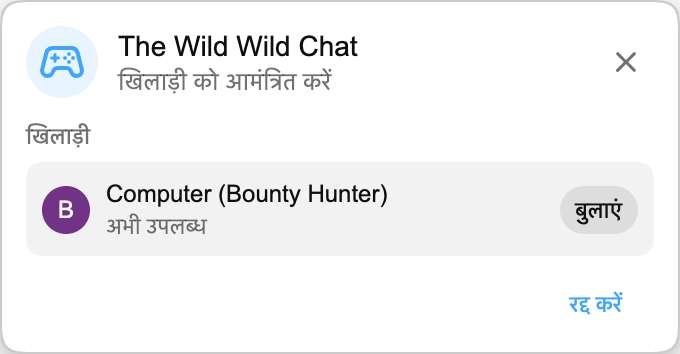

Playground का अगला game live chat में आ रहा है: **The Wild Wild Chat**।

इसकी शुरुआत **Bounty Hunting** से होती है, एक तेज़ खोज मुकाबला जिसमें दो players वही stream chat देखते हैं और समय खत्म होने से पहले सही messages पहचानने की दौड़ लगाते हैं।

:::media-right

{shadow=smooth;rotate=-6deg}

### यह कैसे काम करता है

Live chat से Playground match शुरू करें, दूसरे player को invite करें, और round तैयार होने तक थोड़ा इंतज़ार करें।

हर round में chat में अपने-आप होने वाली चीज़ों पर आधारित छह इनाम होते हैं। आपको 3+ emoji वाला message, all-caps message, कोई सवाल, user mention, verified chatter, link, number, दोहराया गया phrase, या ज़्यादा active chatters में से किसी एक को ढूँढ़ना पड़ सकता है।

दोनों players **तैयार** दबाते हैं, फिर छोटा 3, 2, 1 countdown असली hunt शुरू कर देता है। उसके बाद आपके पास 60 seconds होते हैं।

:::

## इनाम claim करना

Wanted board वे बनाम आप, live timer, और छह open इनाम दिखाता है। हर इनाम में money value, description, और **खुला** या **जीता गया** stamp होता है।

किसी इनाम को claim करने के लिए live chat के किसी message पर click करें। अगर message किसी open इनाम से match करता है, तो game उस पर claimed stamp लगा देता है, money आपके score में जोड़ता है, और आपका avatar उस row पर रख देता है।

पहला valid claim वही इनाम जीतता है। एक बार claim हो जाने के बाद वह दोनों players के लिए close हो जाता है, इसलिए अगले मौके के लिए chat scan करते रहें।

## Round खत्म

Round तब खत्म होता है जब timer zero पर पहुँचता है या सभी छह इनाम claim हो जाते हैं।

छोटी round-over screen के बाद, **The Ledger** final result दिखाता है। Winner पहले आता है, फिर दूसरा player, और हर player के avatar, rank, claimed इनाम और earned money दिखते हैं। सबसे ज़्यादा money वाला player जीतता है।

## Live chat के लिए बनाया गया

The Wild Wild Chat सिर्फ live chat के दौरान उपलब्ध है, क्योंकि game stream chat पर उसी समय react करने के बारे में है जब वह चल रहा होता है।

इसमें compact mode भी है। अगर पूरा wanted poster बहुत ज़्यादा chat ढक रहा है, तो panel को छोटी row में shrink कर दें। Timer और score दिखते रहेंगे, और feed पढ़ना आसान रहेगा।

## Playground का हिस्सा

शतरंज और HELP-A-FRIEND! Trivia की तरह, The Wild Wild Chat भी Playground के अंदर रहता है। यह वही गेम पैनल, वही invite flow, और वही floating game window इस्तेमाल करता है, इसलिए यह YouTube chat के पास ही रहता है।

:::media-left

Playground अभी भी opt-in है। Extension settings से **Playground से जुड़ें** enable करें, chat वाला live stream खोलें, और update आने पर गेम बटन देखें।

:::
