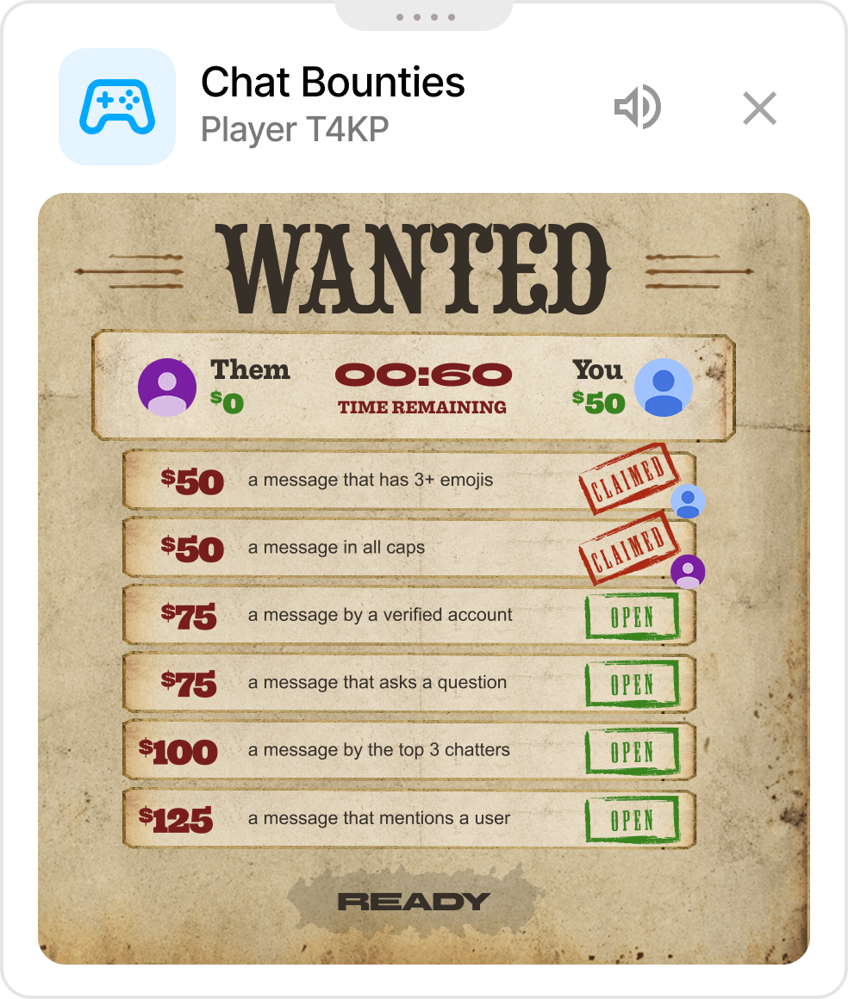
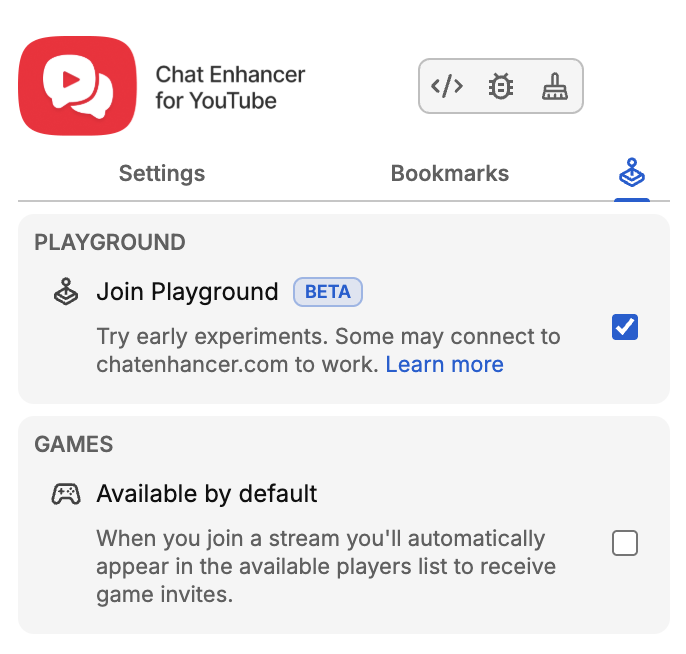

Il prossimo gioco di Playground sta arrivando nella live chat: **The Wild Wild Chat**.

Si parte con **Bounty Hunting**, una caccia rapida in cui due giocatori guardano la stessa chat dello stream e corrono per trovare i messaggi giusti prima che scada il tempo.

:::media-right

{shadow=smooth;rotate=-6deg}

### Come funziona

Avvia una partita di Playground dalla live chat, invita un altro giocatore e aspetta un momento mentre il gioco prepara il round.

Ogni round riceve sei taglie basate su cose che accadono naturalmente in chat. Potresti dover trovare un messaggio con 3+ emoji, un messaggio tutto in maiuscolo, una domanda, una menzione utente, un partecipante verificato, un link, un numero, una frase ripetuta o uno dei partecipanti più attivi.

Entrambi i giocatori premono **Pronto**, poi un breve conto alla rovescia 3, 2, 1 dà il via alla vera caccia. Da quel momento hai 60 secondi.

:::

## Rivendicare le taglie

La bacheca dei ricercati mostra **Loro contro te**, il timer live e le sei taglie aperte. Ogni taglia ha un valore in denaro, una descrizione e un timbro **Aperta** o **Rivendicata**.

Per rivendicarne una, fai clic su un messaggio della live chat. Se il messaggio corrisponde a una taglia aperta, il gioco la timbra come rivendicata, aggiunge il denaro al tuo punteggio e mette il tuo avatar sulla riga.

La prima rivendicazione valida vince quella taglia. Una volta rivendicata, viene chiusa per entrambi i giocatori, quindi continua a scandagliare la chat in cerca della prossima occasione.

## Fine del round

Il round termina quando il timer arriva a zero o quando tutte e sei le taglie sono state rivendicate.

Dopo una breve schermata di fine round, **The Ledger** mostra il risultato finale. Il vincitore appare per primo, seguito dall’altro giocatore, con avatar, rango, taglie rivendicate e denaro guadagnato da ciascuno. Vince il giocatore con più denaro.

## Creato per la live chat

The Wild Wild Chat è disponibile solo durante la live chat, perché il gioco consiste nel reagire alla chat dello stream mentre accade.

C’è anche una modalità compatta per questo gioco. Se il poster completo dei ricercati copre troppa chat, riduci il pannello a una piccola riga che mantiene visibili timer e punteggio e lascia la chat più facile da leggere.

## Parte di Playground

Come Chess e HELP-A-FRIEND! Trivia, The Wild Wild Chat vive dentro Playground. Usa lo stesso pannello Games, lo stesso flusso di inviti e la stessa finestra di gioco flottante, così resta vicino alla chat di YouTube invece di diventare un’app separata.

Lo stile però è nuovo: poster dei ricercati, rivendicazioni timbrate, carta polverosa e un po’ di gusto western.

:::media-left

Playground resta opzionale. Attiva **Join Playground** dalle impostazioni dell’estensione, apri una live con chat e cerca il pulsante Games quando arriverà l’aggiornamento.

:::
