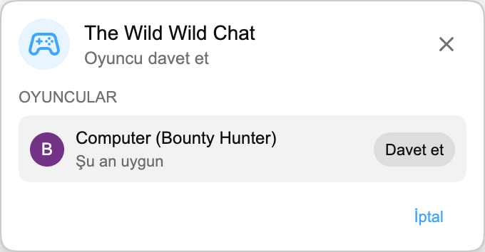

Sıradaki Playground oyunu canlı sohbete geliyor: **The Wild Wild Chat**.

Her şey **Bounty Hunting** ile başlıyor: iki oyuncu aynı yayın sohbetini izliyor ve süre bitmeden doğru mesajları bulmak için yarışıyor.

:::media-right

{shadow=smooth;rotate=-6deg}

### Nasıl çalışır

Canlı sohbetten bir Playground maçı başlat, başka bir oyuncuyu davet et ve tur hazırlanırken kısa bir süre bekle.

Her turda, sohbette doğal olarak görülen şeylere göre belirlenen altı ödül bulunur. 3+ emoji içeren bir mesajı, tamamen büyük harfli bir mesajı, bir soruyu, kullanıcı mention’ını, verified chatter’ı, bir bağlantıyı, bir sayıyı, tekrarlanan bir ifadeyi veya en hareketli sohbetçilerden birini bulman gerekebilir.

İki oyuncu da **HAZIR** düğmesine basar, ardından kısa bir 3, 2, 1 geri sayımı gerçek avı başlatır. Bundan sonra 60 saniyen var.

:::

## Ödülleri almak

Arananlar panosu Onlar vs Sen, canlı zamanlayıcıyı ve altı açık ödülü gösterir. Her ödülün bir para değeri, açıklaması ve **Acik** ya da **Alindi** damgası vardır.

Bir ödül almak için canlı sohbet mesajına tıkla. Mesaj açık bir ödülle eşleşirse oyun o ödülü damgalar, parayı skoruna ekler ve avatarını o satıra yerleştirir.

İlk geçerli tıklama o ödülü kazanır. Ödül alındıktan sonra iki oyuncu için de kapanır, bu yüzden sıradaki fırsat için sohbeti taramaya devam et.

## Tur bitti

Tur, zamanlayıcı sıfıra ulaştığında veya altı ödülün tamamı alındığında biter.

Kısa bir tur sonu ekranından sonra **The Ledger** final sonucunu gösterir. Kazanan önce görünür, ardından diğer oyuncu gelir; her oyuncunun avatarı, rütbesi, aldığı ödüller ve kazandığı para gösterilir. En çok parayı toplayan kazanır.

## Canlı sohbet için yapıldı

The Wild Wild Chat yalnızca canlı sohbet sırasında kullanılabilir, çünkü oyun tam olarak yayın sohbeti akarken ona tepki vermek üzerine kurulu.

Kompakt mod da var. Tam arananlar posteri sohbetin çok fazla kısmını kapatıyorsa paneli zamanlayıcı ve skoru görünür tutan küçük bir satıra küçült; sohbeti okumak daha kolay olur.

## Playground’un parçası

Satranç ve HELP-A-FRIEND! Trivia gibi The Wild Wild Chat de Playground içinde yaşar. Aynı Oyunlar paneli, aynı davet akışını ve aynı yüzen oyun penceresini kullanır; böylece YouTube sohbetine yakın kalır.

:::media-left

Playground hâlâ isteğe bağlı. Uzantı ayarlarından **Playground’a katıl** seçeneğini aç, sohbetli bir canlı yayın aç ve güncelleme geldiğinde Oyunlar Oyunlar düğmesi ara.

:::
