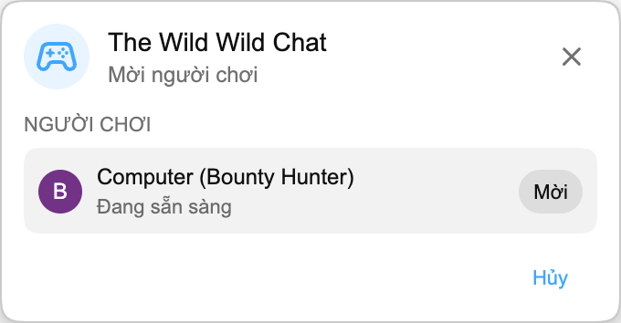

Trò chơi Playground tiếp theo đang đi vào live chat: **The Wild Wild Chat**.

Trò chơi bắt đầu với **Bounty Hunting**, một màn săn tìm ngắn trong đó hai người chơi xem cùng chat của stream và chạy đua để tìm đúng tin nhắn trước khi hết thời gian.

:::media-right

{shadow=smooth;rotate=-6deg}

### Cách hoạt động

Bắt đầu một trận Playground từ live chat, mời người chơi khác và chờ một lúc trong khi vòng chơi được chuẩn bị.

Mỗi vòng có sáu bounty dựa trên những điều tự nhiên xảy ra trong chat. Bạn có thể cần tìm một tin nhắn có 3+ emoji, một tin nhắn all-caps, một câu hỏi, user mention, verified chatter, link, một con số, một cụm lặp lại hoặc một trong những chatter hoạt động nhiều hơn.

Cả hai người chơi nhấn **SAN SANG**, rồi phần đếm ngược ngắn 3, 2, 1 bắt đầu cuộc săn thật sự. Sau đó, bạn có 60 giây.

:::

## Claim bounty

Bảng wanted hiển thị Ho vs Ban, live timer và sáu bounty đang open. Mỗi bounty có giá trị tiền, mô tả và dấu **Mo** hoặc **Da lay**.

Để claim một bounty, hãy nhấp vào một tin nhắn live chat. Nếu tin nhắn khớp với một bounty đang open, trò chơi đóng dấu bounty đó là claimed, cộng tiền vào điểm của bạn và đặt avatar của bạn lên hàng đó.

Claim hợp lệ đầu tiên thắng bounty đó. Sau khi đã claim, bounty sẽ đóng với cả hai người chơi, vì vậy hãy tiếp tục quét chat để tìm cơ hội tiếp theo.

## Hết vòng

Vòng chơi kết thúc khi timer về 0 hoặc khi cả sáu bounty đã được claim.

Sau màn hình hết vòng ngắn, **The Ledger** hiển thị kết quả cuối cùng. Người thắng xuất hiện trước, tiếp theo là người chơi còn lại, cùng avatar, rank, số bounty đã claim và tiền kiếm được của từng người. Người chơi có nhiều tiền nhất thắng.

## Dành cho live chat

The Wild Wild Chat chỉ khả dụng trong live chat, vì trò chơi xoay quanh việc phản ứng với chat của stream khi nó đang diễn ra.

Trò chơi này cũng có chế độ thu gọn. Nếu wanted poster đầy đủ che quá nhiều chat, hãy thu nhỏ panel thành một hàng nhỏ vẫn giữ timer và điểm số hiển thị, đồng thời giúp feed dễ đọc hơn.

## Một phần của Playground

Giống như Cờ vua và HELP-A-FRIEND! Trivia, The Wild Wild Chat nằm trong Playground. Nó dùng cùng bảng Trò chơi, cùng invite flow và cùng floating game window, nên vẫn ở gần chat YouTube.

:::media-left

Playground vẫn là tính năng chọn tham gia. Bật **Tham gia Playground** trong cài đặt tiện ích, mở một live stream có chat và tìm nút Trò chơi khi bản cập nhật đến.

:::
