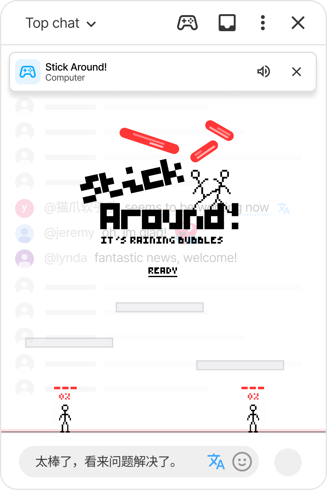

Sıradaki Playground oyunu **Stick Around!**: kompakt bir panelde durmayan küçük bir dövüş oyunu.

Sohbet akışının kendisini ele geçirir.

Sayfayı değil. Videoyu değil. Mesaj kutusunu değil. Sadece canlı sohbetin aktığı alanı küçük bir arenaya dönüştürür; iki çöp adam, yukarıdan düşen mesajların arasında hayatta kalmaya çalışır.

## Baloncuk yağmuru

Stick Around!’da yorumlar hava durumuna dönüşür.

Sohbet sakinken arenada hareket edecek alan vardır. Sohbet hareketlendikçe dövüşün içine daha fazla mesaj baloncuğu düşmeye başlar. Bazıları süzülür, bazıları döner, bazıları diğerlerinden daha ağır iner ve yerel sohbet metni baloncuklar düşerken üzerlerinde görünebilir.

Amaç basit: hareket et, zıpla, diğer oyuncuyu savur, düşen sohbetten kaç ve tüm stocks’larını kaybetmemeye çalış.

:::media-right

{shadow=smooth rotation=1}

Stick Around! tüm sohbet akışını oyun alanı olarak kullanır. Normal sohbet başlığı ve giriş alanı yerinde kalır.

:::

## Farklı bir Playground oyunu

Satranç, HELP-A-FRIEND! Trivia ve The Wild Wild Chat kompakt oyun panelleri kullanır. Stick Around! farklıdır, çünkü arena tüm sohbet akışına ihtiyaç duyar.

Bu yüzden YouTube sohbetinin yanında duran bir şeyden çok, sohbetin *içinde* olan bir şey gibi hissettirir. Başlıkta hâlâ diğer oyun panellerindeki basit kontroller bulunur; gizleme ve ses dahil. Ama maçın kendisi doğrudan akışın üzerine çizilir.

Katman oyunu okunur tutar, sohbet de altta görünmeye devam eder. Böylece ayrı bir ekrana dönüşmek yerine yayına bağlı kalır.

## Başka bir izleyiciye veya Computer'a karşı oyna

Stick Around! normal Playground davet akışını kullanır. Oyunlar paneli aç, Stick Around!’u seç ve aynı yayındaki birini davet et.

Yakında başka oyuncu yoksa **Computer**’ı da davet edebilirsin. Böylece oyun küçük sohbetlerde, gece yayınlarında veya başka bir izleyiciyi beklemeden kaosu test etmek istediğin anlarda da kullanılabilir kalır.

İki oyuncu da **HAZIR**’ye basar, geri sayım başlar ve ardından maç başlar.

## Kazanmayı veya kaybetmeyi ne belirler

Her oyuncunun üç stocks’u vardır. Darbe almak damage’ını artırır; damage yükseldikçe darbeler seni daha uzağa gönderir. Arenanın altından veya yanlarından düşersen bir stock kaybedersin. Stocks’un biterse diğer oyuncu kazanır.

## Neden sohbete ait

Stick Around! basit bir fikirle başladı: sohbet akışı oyunun sadece arkasında durmak yerine oyunun bir parçası olsaydı ne olurdu?

Bu yüzden düşen baloncuklar sohbet hacmine bağlıdır. Yavaş bir yayın hafif bir maça dönüşür. Hızlı bir yayın fırtınaya dönüşür. Yorumlar hâlâ yorum gibi davranır, ama konuşma yükseldikçe arena daha tehlikeli olur.

Saçma, hızlı ve canlı sohbetin olabildiği şekilde biraz adaletsiz.

Bu, Playground gibi hissettiriyor.
