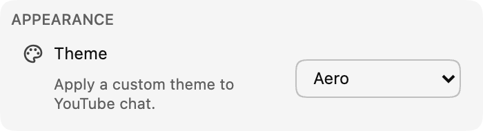

*Chat themes are now available in version 0.17!*

Themes make chat more personal. We are starting with a set of ready-made themes, beginning with **Aero**, and plan to add customization later.

:::media-left

{width=77%;rotate=3.5deg}

To enable a theme, open **Appearance** in the extension settings and choose one from the list.

:::

## About the Aero theme
Aero draws on the glossy, translucent look of late-2000s chat interfaces. 💧

Send theme suggestions to [hello@chatenhancer.com](mailto:hello@chatenhancer.com).
