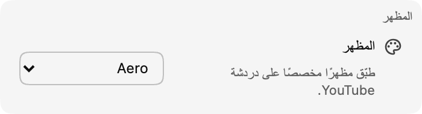

*سمات الدردشة متاحة الآن في الإصدار 0.17!*

تهدف السمات إلى جعل الدردشة أكثر شخصية بالنسبة لك. في الوقت الحالي، سنصدر مجموعة جاهزة من السمات (بدءا من **Aero**)، مع سمات قابلة للتخصيص في المستقبل.

:::media-left

{rotate=3.5deg}

لتفعيل سمة، انتقل إلى قسم **المظهر** في إعدادات الإضافة. اختر إحدى السمات المتاحة لإضفاء لمسة جديدة على واجهة الدردشة!

:::

## حول سمة Aero
Aero هي سمة تحاكي جماليات واجهات الدردشة في أواخر عام 2007. إنها حنينية، مائية، ومنعشة! 💧

أرسل اقتراحاتك للسمات إلى [hello@chatenhancer.com](mailto:hello@chatenhancer.com).
