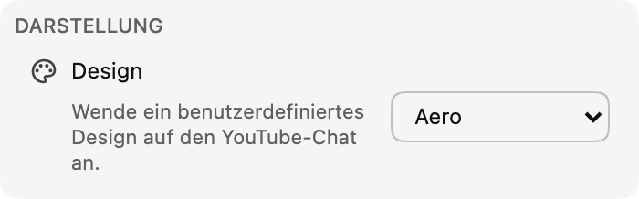

*Chat-Themes sind jetzt in Version 0.17 verfügbar!*

Themes sollen den Chat persönlicher für dich machen. Vorerst veröffentlichen wir eine fertige Auswahl an Themes (beginnend mit **Aero**), später kommen anpassbare Themes dazu.

:::media-left

{width=77%;rotate=3.5deg}

Um ein Theme zu aktivieren, gehe in den Erweiterungseinstellungen zum Abschnitt **Darstellung**. Wähle eines der verfügbaren Themes, um die Chat-Oberfläche aufzufrischen!

:::

## Über das Aero-Theme
Aero ist ein Theme, das die Ästhetik von Chat-Oberflächen aus Ende 2007 nachahmt. Es ist nostalgisch, glasig-wässrig und erfrischend! 💧

Sende Theme-Vorschläge an [hello@chatenhancer.com](mailto:hello@chatenhancer.com).
