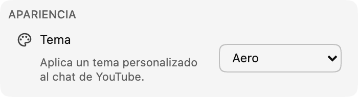

*¡Los temas de chat ya están disponibles en la versión 0.17!*

Los temas permiten personalizar el chat. Empezamos con una selección de diseños preparados, comenzando por **Aero**, y más adelante añadiremos opciones de personalización.

:::media-left

{width=77%;rotate=3.5deg}

Para activar un tema, abre **Apariencia** en los ajustes de la extensión y elige uno de la lista.

:::

## Sobre el tema Aero
Aero se inspira en el aspecto brillante y translúcido de las interfaces de chat de finales de los 2000. 💧

Envíanos tus sugerencias de temas a [hello@chatenhancer.com](mailto:hello@chatenhancer.com).
