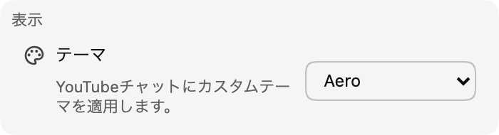

*チャットテーマがバージョン 0.17 で利用できるようになりました！*

テーマは、チャットをもっと自分好みに感じられるようにするためのものです。まずは既製テーマのセットを公開していきます（最初は **Aero**）。将来的にはカスタマイズ可能なテーマも追加する予定です。

:::media-left

{width=77%;rotate=3.5deg}

テーマを有効にするには、拡張機能の設定で **外観** セクションに移動します。利用できるテーマの中から選んで、チャット画面に変化を加えてみてください！

:::

## Aero テーマについて
Aero は、2007 年末ごろのチャット画面の雰囲気を再現したテーマです。懐かしく、水のようで、さわやかです！ 💧

テーマのアイデアは [hello@chatenhancer.com](mailto:hello@chatenhancer.com) までお寄せください。
