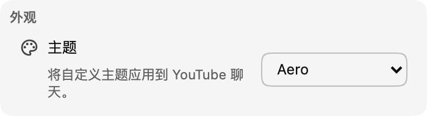

*聊天主题现已在 0.17 版本中推出！*

主题是为了让聊天更符合你的个人喜好。现阶段，我们会发布一组预设主题（从 **Aero** 开始），未来还会加入可自定义的主题。

:::media-left

{width=77%;rotate=3.5deg}

要启用主题，请前往扩展设置中的 **外观** 部分。选择一个可用主题，为聊天界面增添一点新鲜感！

:::

## 关于 Aero 主题
Aero 是一个模仿 2007 年末聊天界面美学的主题。它怀旧、清透，并且很清爽！💧

欢迎将主题建议发送至 [hello@chatenhancer.com](mailto:hello@chatenhancer.com)。
