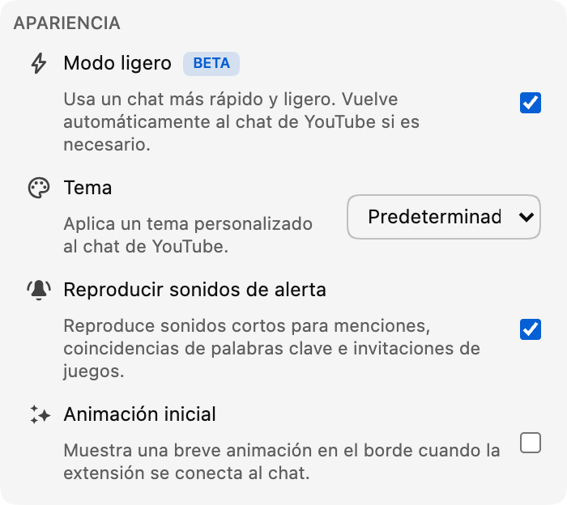

*El modo Lite ya está disponible en beta en la versión 0.18.*

Un chat muy activo puede ser una de las mejores partes de un directo, pero los mensajes, avatares, insignias y animaciones pueden exigir cada vez más al navegador.

El modo Lite es un feed de mensajes opcional y ligero, diseñado para mantener la fluidez cuando el chat se llena.

## Qué cambia el modo Lite

El modo Lite sustituye únicamente el feed desplazable de mensajes. El vídeo, el encabezado del chat, el cuadro de mensajes, el selector de emojis, la selección de chat, los ajustes y la vista de participantes siguen perteneciendo a YouTube.

Mantiene activos menos elementos, imágenes y efectos a la vez, lo que reduce el trabajo necesario para mostrar el chat.

La mejora debería notarse sobre todo en chats rápidos o sesiones largas, aunque el resultado depende del directo, el dispositivo, las demás extensiones y las funciones activas. El modo Lite no cambia la reproducción del vídeo.

## Un chat familiar, más ligero por dentro

Los mensajes conservan el diseño familiar de YouTube, incluidos los avatares, nombres de usuario, insignias de moderador y verificación, marcas de tiempo, emojis personalizados, membresías, regalos y mensajes de pago.

Las funciones de Chat Enhancer, como la traducción, los destacados de Inbox, los perfiles, el modo Focus, los marcadores, las acciones de mensajes, los temas y las secciones compatibles de Playground, siguen funcionando.

Algunas acciones de YouTube, como denunciar o bloquear a una persona, todavía no están disponibles en el modo Lite. Ampliaremos la compatibilidad en futuras actualizaciones.

:::media-right

{width=95%;rotate=-4.5deg}

## Cómo activarlo
Activa el **modo Lite** desde la sección **Apariencia** de la ventana emergente de la extensión. También puedes usar el botón con forma de rayo del encabezado del chat cuando quieras cambiar rápidamente.

:::

## Una forma segura de volver al chat de YouTube

Si el modo Lite pierde el acceso al feed o deja de recibir mensajes, Chat Enhancer vuelve a cargar el panel y restaura automáticamente el chat de YouTube.

Verás un breve aviso, pero el vídeo y el resto de la página no se volverán a cargar.

Los mensajes se siguen leyendo y enviando a través de YouTube; el modo Lite no añade otra cuenta ni un servicio de chat independiente. La traducción y Playground mantienen el comportamiento de red descrito en nuestra [política de privacidad](/privacy/).

## ¿Por qué la etiqueta beta?

El feed ligero ya cubre el uso habitual, pero seguimos ajustando el desplazamiento, las transiciones en repeticiones, el diseño, el rendimiento y la compatibilidad con nuevos formatos de mensajes. Por eso el interruptor lleva la insignia **Beta**.

Si algo no funciona como esperabas, cuéntanos qué observaste en [hello@chatenhancer.com](mailto:hello@chatenhancer.com). Resulta especialmente útil incluir un enlace a la emisión, indicar si era en directo o una repetición y explicar qué ocurrió justo antes del problema.
