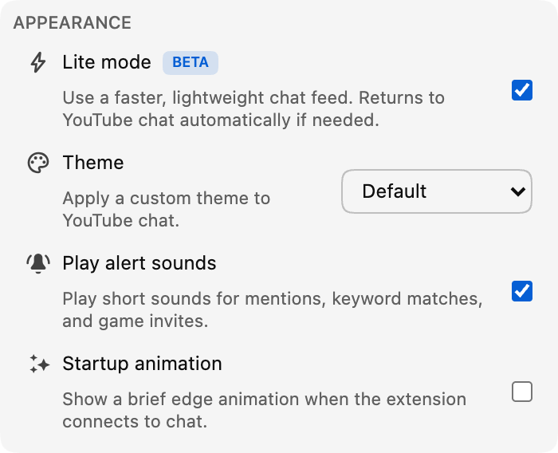

*Lite mode is now available in beta in version 0.18.*

A busy live chat can be one of the best parts of a stream, but messages, avatars, badges, and animations can put extra pressure on your browser over time.

Lite mode is an optional, lightweight message feed designed to stay responsive when chat gets crowded.

## What Lite mode changes

Lite mode replaces only the scrolling message feed. The video, chat header, message box, emoji picker, chat selection, settings, and Participants view still belong to YouTube.

It keeps fewer chat elements, images, and effects active at once, reducing the work required to display the feed.

The biggest improvement should appear in fast chats or long viewing sessions, although results depend on the stream, device, other extensions, and enabled features. Lite mode does not change video playback.

## Familiar chat, lighter underneath

Messages keep the familiar YouTube-style layout, including avatars, handles, moderator and verified badges, timestamps, custom emoji, memberships, gifts, and paid messages.

Chat Enhancer features such as translation, Inbox highlights, profiles, Focus mode, bookmarks, message actions, themes, and supported Playground surfaces continue to work.

Some YouTube actions, including reporting or blocking a chatter, are not yet available in Lite mode. Support will expand in future updates.

:::media-right

{width=95%;rotate=-4.5deg}

## How to turn it on
Turn on **Lite mode** from the **Appearance** section of the extension popup. You can also use the lightning-bolt button in the chat header when you want to switch quickly.

:::

## A safe way back to YouTube chat

If Lite mode loses access to the chat feed or stops receiving updates, Chat Enhancer reloads the chat panel and restores YouTube chat automatically.

You will see a short notice, and the video and watch page will not reload.

Reading and sending messages still use YouTube; Lite mode does not add another account or chat service. Translation and Playground keep the network behavior described in our [privacy policy](/privacy/).

## Why the beta label?

The lightweight feed covers everyday chat, but we are still tuning scrolling, replay transitions, styling, performance, and support for new YouTube message formats. That is why the toggle has a **Beta** badge.

If something feels off, tell us what you noticed at [hello@chatenhancer.com](mailto:hello@chatenhancer.com). A stream link, whether it was live or a replay, and what happened before the problem are especially helpful.
