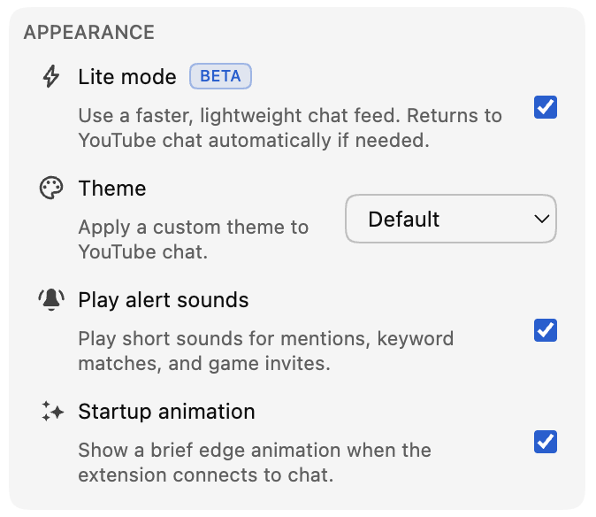

*De Lite-modus is vanaf versie 0.18 beschikbaar als bèta.*

Een drukke livechat kan een van de leukste onderdelen van een stream zijn. Tegelijk kan zo’n chat veel van je browser vragen wanneer berichten, avatars, badges, animaties en andere chatelementen zich langere tijd opstapelen.

De Lite-modus biedt een andere optie: een kleinere, lichte berichtenfeed die responsief blijft wanneer het druk wordt in de chat.

De functie is volledig optioneel en je kunt haar op elk moment in- of uitschakelen.

## Wat de Lite-modus verandert

De Lite-modus vervangt alleen de scrollende berichtenfeed. De video, chatkop, het berichtenvak, de emojikiezer, chatselectie, instellingen en deelnemersweergave blijven onderdeel van YouTube.

Wanneer de Lite-modus is ingeschakeld, vervangt Chat Enhancer de oorspronkelijke feed door een eigen lichte versie. Daardoor hoeven minder chatelementen, afbeeldingen en effecten tegelijk actief te blijven, wat de prestaties verbetert.

De grootste verbetering zal waarschijnlijk merkbaar zijn in snelle chats of tijdens lange kijksessies. Het precieze verschil blijft afhangen van de stream, je apparaat, je andere extensies en de functies die je hebt ingeschakeld. De Lite-modus richt zich op de chatfeed en verandert niets aan de verwerking die nodig is om de video zelf af te spelen.

## Vertrouwde chat, lichter vanbinnen

Berichten behouden de vertrouwde YouTube-achtige indeling, met onder meer avatars, gebruikersnamen, moderator- en verificatiebadges, tijdstempels, aangepaste emoji, lidmaatschappen, cadeaus en betaalde berichten.

Ook de functies van Chat Enhancer blijven in de lichte rijen werken. Daaronder vallen vertaling, Inbox-markeringen, gebruikersprofielen en recente berichten, Focus-modus, bladwijzers, berichtacties, thema’s en ondersteunde Playground-oppervlakken.

Sommige YouTube-functies worden mogelijk nog niet ondersteund in de Lite-modus, zoals het rapporteren of blokkeren van iemand in de chat. Ondersteuning voor deze functies wordt toegevoegd in toekomstige updates van de extensie. We blijven de Lite-modus bijwerken wanneer YouTube nieuwe functies introduceert.

:::media-right

{width=95%;rotate=-4.5deg}

## Zo schakel je de functie in
Schakel de **Lite-modus** in via het gedeelte **Weergave** in de pop-up van de extensie. Je kunt ook de knop met het bliksemsymbool in de chatkop gebruiken om snel te wisselen.

:::

## Veilig terug naar de YouTube-chat

YouTube wijzigt zijn chatformaten in de loop van de tijd en livestreams kunnen ongebruikelijke berichttypen of verbindingsstatussen bevatten. Als de Lite-modus de centrale chatfeed niet meer kan lezen, geen updates meer ontvangt of het benodigde deel van de pagina kwijtraakt, laadt Chat Enhancer het chatpaneel opnieuw en wordt de YouTube-chat automatisch hersteld.

Je ziet een korte melding waarin staat dat de YouTube-chat is hersteld. De video en de rest van de kijkpagina worden niet opnieuw geladen.

De Lite-modus voegt zelf geen extra chataccount toe en verstuurt geen berichten via een aparte chatdienst. Het lezen en verzenden van chatberichten blijft via YouTube verlopen. Als vertaling of Playground is ingeschakeld, behouden die functies hetzelfde netwerkgedrag als beschreven in ons [privacybeleid](/privacy/).

## Waarom het bètalabel?

De lichte feed dekt de alledaagse chatervaring al, maar de details zijn belangrijk. We verwachten de berichtsnelheid, het scrollen, overgangen bij herhalingen, de vormgeving, prestatielimieten en ondersteuning voor nieuwe YouTube-berichtformaten verder te verfijnen terwijl we leren hoe de Lite-modus zich gedraagt bij meer streams en apparaten.

Daarom heeft de schakelaar een **Bèta**-badge. De functie is klaar om te proberen, maar zal nog blijven veranderen.

Voelt iets niet goed, laat ons dan via [hello@chatenhancer.com](mailto:hello@chatenhancer.com) weten wat je hebt gezien. Vooral een link naar de stream, of het live was of een herhaling, en wat er vlak vóór het probleem gebeurde, zijn nuttig.
