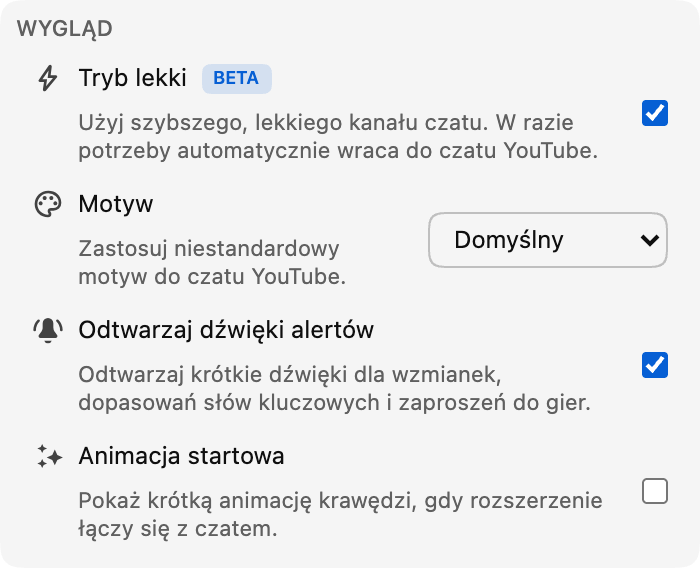

*Tryb Lite jest już dostępny w wersji beta od wydania 0.18.*

Intensywny czat na żywo może być jedną z najlepszych części transmisji. Może też mocno obciążać przeglądarkę, gdy przez dłuższy czas gromadzą się wiadomości, awatary, odznaki, animacje i inne elementy czatu.

Tryb Lite daje dodatkową możliwość: mniejszy, lekki strumień wiadomości zaprojektowany tak, aby zachować szybkość reakcji, gdy na czacie robi się tłoczno.

## Co zmienia tryb Lite

Tryb Lite zastępuje wyłącznie przewijany strumień wiadomości. Film, nagłówek czatu, pole wiadomości, selektor emoji, wybór czatu, ustawienia oraz widok Uczestnicy nadal należą do YouTube.

Gdy tryb Lite jest włączony, Chat Enhancer zastępuje oryginalny strumień własną lekką wersją. Dzięki temu mniej elementów czatu, obrazów i efektów musi pozostawać aktywnych jednocześnie, co poprawia wydajność.

Największa poprawa powinna być odczuwalna na szybkich czatach lub podczas długich sesji oglądania. Dokładna różnica nadal zależy od transmisji, urządzenia, innych rozszerzeń i włączonych funkcji. Tryb Lite koncentruje się na strumieniu czatu; nie zmienia obciążenia związanego z odtwarzaniem samego filmu.

## Znajomy czat, lżejszy od środka

Wiadomości zachowują znajomy układ w stylu YouTube, w tym awatary, nazwy użytkowników, odznaki moderatora i zweryfikowanego konta, znaczniki czasu, niestandardowe emoji, członkostwa, prezenty oraz płatne wiadomości.

Funkcje Chat Enhancer również nadal działają w lekkich wierszach. Obejmuje to tłumaczenie, wyróżnienia Inbox, profile użytkowników i ostatnie wiadomości, tryb Focus, zakładki, działania na wiadomościach, motywy i obsługiwane powierzchnie Playground.

Niektóre funkcje YouTube mogą nie być jeszcze obsługiwane w trybie Lite, na przykład zgłaszanie lub blokowanie osoby na czacie. Obsługa tych funkcji pojawi się w przyszłych aktualizacjach rozszerzenia. Będziemy nadal aktualizować tryb Lite wraz z wprowadzaniem kolejnych funkcji przez YouTube.

:::media-right

{width=95%;rotate=-4.5deg}

## Jak go włączyć
Włącz **tryb Lite** w sekcji **Wygląd** okna podręcznego rozszerzenia. Aby szybko przełączać tryb, możesz też użyć przycisku z błyskawicą w nagłówku czatu.

:::

## Bezpieczny powrót do czatu YouTube

YouTube z czasem zmienia formaty czatu, a transmisje na żywo mogą zawierać nietypowe typy wiadomości lub stany połączenia. Jeśli tryb Lite nie będzie mógł dalej odczytywać głównego strumienia czatu, przestanie otrzymywać aktualizacje albo utraci potrzebny fragment strony, Chat Enhancer ponownie załaduje panel czatu i automatycznie przywróci czat YouTube.

Zobaczysz krótkie powiadomienie informujące o przywróceniu czatu YouTube. Film i pozostała część strony odtwarzania nie zostaną ponownie załadowane.

Tryb Lite sam nie dodaje kolejnego konta czatu ani nie wysyła wiadomości przez osobną usługę czatu. Odczytywanie i wysyłanie wiadomości nadal odbywa się przez YouTube. Jeśli masz włączone tłumaczenie lub Playground, te funkcje zachowują to samo działanie sieciowe opisane w naszej [polityce prywatności](/privacy/).

## Skąd etykieta beta?

Lekki strumień obsługuje już codzienne korzystanie z czatu, ale szczegóły mają znaczenie. Zamierzamy nadal dopracowywać tempo wiadomości, przewijanie, przejścia w powtórkach, styl, limity wydajności i obsługę nowych formatów wiadomości YouTube, w miarę poznawania działania trybu Lite w kolejnych transmisjach i na kolejnych urządzeniach. Dlatego przełącznik ma odznakę **Beta**. Funkcja jest gotowa do wypróbowania, ale nadal będzie się zmieniać.

Jeśli coś wydaje się nieprawidłowe, napisz na [hello@chatenhancer.com](mailto:hello@chatenhancer.com), co udało Ci się zauważyć. Szczególnie pomocne będą link do transmisji, informacja, czy była to transmisja na żywo czy powtórka, oraz opis tego, co wydarzyło się tuż przed problemem.
