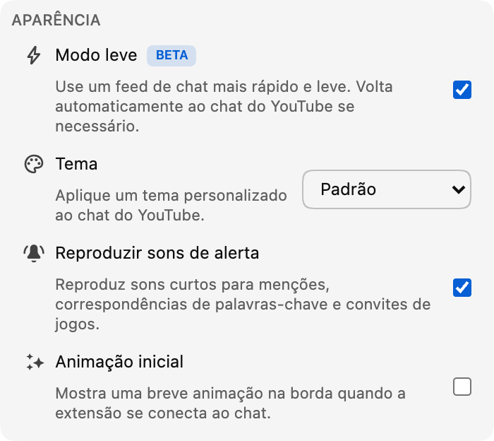

*O modo Lite já está disponível em versão beta na versão 0.18.*

Um chat ao vivo movimentado pode ser uma das melhores partes de uma transmissão. Mas também pode exigir bastante do navegador depois que mensagens, avatares, selos, animações e outros elementos do chat se acumulam por algum tempo.

O modo Lite oferece outra opção: um feed de mensagens menor e leve, criado para continuar responsivo quando o chat fica cheio.

## O que o modo Lite muda

O modo Lite substitui apenas o feed rolável de mensagens. O vídeo, o cabeçalho do chat, a caixa de mensagens, o seletor de emojis, a seleção de chat, as configurações e a visualização de Participantes continuam pertencendo ao YouTube.

Enquanto o modo Lite está ativado, o Chat Enhancer substitui o feed original por sua própria versão leve. Isso significa que menos elementos do chat, imagens e efeitos precisam permanecer ativos ao mesmo tempo, melhorando o desempenho.

A maior melhoria deve ser perceptível em chats rápidos ou sessões longas de visualização. A diferença exata ainda dependerá da transmissão, do seu dispositivo, das outras extensões e dos recursos ativados. O modo Lite se concentra no feed do chat; ele não altera o processamento necessário para reproduzir o vídeo em si.

## Chat familiar, mais leve por dentro

As mensagens mantêm o layout familiar do YouTube, incluindo avatares, nomes de usuário, selos de moderador e de verificação, horários, emojis personalizados, assinaturas, presentes e mensagens pagas.

Os recursos do Chat Enhancer também continuam funcionando nas linhas leves. Isso inclui tradução, destaques do Inbox, perfis de usuário e mensagens recentes, modo Focus, favoritos, ações de mensagem, temas e superfícies compatíveis do Playground.

Alguns recursos do YouTube talvez ainda não sejam compatíveis com o modo Lite, por exemplo, a possibilidade de denunciar ou bloquear alguém no chat. Esses recursos passarão a ser compatíveis em futuras atualizações da extensão. Continuaremos atualizando o modo Lite à medida que o YouTube introduzir novos recursos.

:::media-right

{width=95%;rotate=-4.5deg}

## Como ativar
Ative o **modo Lite** na seção **Aparência** do pop-up da extensão. Você também pode usar o botão com o ícone de raio no cabeçalho do chat quando quiser alternar rapidamente.

:::

## Uma forma segura de voltar ao chat do YouTube

O YouTube muda seus formatos de chat ao longo do tempo, e transmissões ao vivo podem incluir tipos de mensagem ou estados de conexão incomuns. Se o modo Lite não conseguir continuar lendo o feed principal do chat, parar de receber atualizações ou perder a parte da página de que precisa, o Chat Enhancer recarregará o painel do chat e restaurará automaticamente o chat do YouTube.

Você verá um aviso curto explicando que o chat do YouTube foi restaurado. O vídeo e o restante da página de exibição não serão recarregados.

O modo Lite não adiciona outra conta de chat nem envia mensagens por um serviço de chat separado. A leitura e o envio de mensagens continuam usando o YouTube. Se você tiver ativado a tradução ou o Playground, esses recursos manterão o mesmo comportamento de rede descrito em nossa [política de privacidade](/privacy/).

## Por que o rótulo beta?

O feed leve já cobre a experiência cotidiana do chat, mas os detalhes importam. Pretendemos continuar ajustando o ritmo das mensagens, a rolagem, as transições de replay, o estilo, os limites de desempenho e a compatibilidade com novos formatos de mensagem do YouTube conforme aprendemos como o modo Lite se comporta em mais transmissões e dispositivos. É por isso que o botão tem um selo **Beta**. Ele está pronto para ser testado, mas ainda continuará mudando.

Se algo parecer estranho, conte o que você percebeu pelo e-mail [hello@chatenhancer.com](mailto:hello@chatenhancer.com). Um link da transmissão, a informação de que era ao vivo ou um replay e o que aconteceu antes do problema são especialmente úteis.
