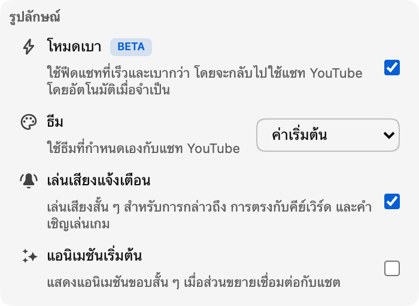

*ขณะนี้โหมด Lite พร้อมใช้งานแบบเบต้าแล้วในเวอร์ชัน 0.18*

แชทสดที่คึกคักอาจเป็นหนึ่งในส่วนที่ดีที่สุดของสตรีม แต่ก็อาจใช้ทรัพยากรของเบราว์เซอร์มากเช่นกัน เมื่อข้อความ อวาตาร์ ป้าย แอนิเมชัน และองค์ประกอบอื่น ๆ ของแชทสะสมต่อเนื่องเป็นเวลานาน

โหมด Lite มอบอีกหนึ่งทางเลือกให้คุณ นั่นคือฟีดข้อความที่เล็กและเบากว่า ซึ่งออกแบบมาให้ยังคงตอบสนองได้รวดเร็วเมื่อแชทมีคนหนาแน่น

## โหมด Lite เปลี่ยนอะไรบ้าง

โหมด Lite จะแทนที่เฉพาะฟีดข้อความที่เลื่อนได้เท่านั้น ส่วนวิดีโอ ส่วนหัวแชท กล่องข้อความ ตัวเลือกอีโมจิ การเลือกแชท การตั้งค่า และมุมมองผู้เข้าร่วมยังคงเป็นของ YouTube

ขณะเปิดใช้โหมด Lite นั้น Chat Enhancer จะแทนที่ฟีดเดิมด้วยเวอร์ชันน้ำหนักเบาของตนเอง ซึ่งหมายความว่าองค์ประกอบแชท รูปภาพ และเอฟเฟกต์ที่ต้องทำงานพร้อมกันจะมีจำนวนน้อยลง ทำให้ประสิทธิภาพดีขึ้น

การปรับปรุงน่าจะเห็นได้ชัดที่สุดในแชทที่เคลื่อนไหวรวดเร็วหรือการรับชมเป็นเวลานาน ความแตกต่างที่แน่นอนยังขึ้นอยู่กับสตรีม อุปกรณ์ ส่วนขยายอื่น ๆ และฟีเจอร์ที่คุณเปิดใช้ โหมด Lite มุ่งเน้นที่ฟีดแชท และไม่ได้เปลี่ยนภาระที่ต้องใช้ในการเล่นวิดีโอเอง

## แชทที่คุ้นเคย แต่เบากว่าภายใน

ข้อความยังคงรูปแบบที่คุ้นเคยในสไตล์ YouTube รวมถึงอวาตาร์ ชื่อผู้ใช้ ป้ายผู้ดูแลและป้ายยืนยัน เวลา อีโมจิแบบกำหนดเอง การเป็นสมาชิก ของขวัญ และข้อความแบบชำระเงิน

ฟีเจอร์ของ Chat Enhancer ยังคงทำงานในแถวแบบน้ำหนักเบาด้วย ซึ่งรวมถึงการแปล การไฮไลต์ Inbox โปรไฟล์ผู้ใช้และข้อความล่าสุด โหมด Focus บุ๊กมาร์ก การดำเนินการกับข้อความ ธีม และพื้นผิว Playground ที่รองรับ

ฟีเจอร์บางอย่างของ YouTube อาจยังไม่รองรับในโหมด Lite เช่น ความสามารถในการรายงานหรือบล็อกผู้ใช้ในแชท ฟีเจอร์เหล่านี้จะได้รับการรองรับในโหมด Lite ผ่านการอัปเดตส่วนขยายในอนาคต เราจะอัปเดตโหมด Lite ต่อไปเมื่อ YouTube เพิ่มฟีเจอร์ใหม่ ๆ

:::media-right

{width=95%;rotate=-4.5deg}

## วิธีเปิดใช้งาน
เปิด **โหมด Lite** จากส่วน **รูปลักษณ์** ในหน้าต่างป๊อปอัปของส่วนขยาย คุณยังสามารถใช้ปุ่มรูปสายฟ้าในส่วนหัวแชทเมื่อต้องการสลับอย่างรวดเร็วได้อีกด้วย

:::

## วิธีที่ปลอดภัยในการกลับไปใช้แชท YouTube

YouTube เปลี่ยนรูปแบบแชทไปตามเวลา และสตรีมสดอาจมีประเภทข้อความหรือสถานะการเชื่อมต่อที่ไม่ปกติ หากโหมด Lite ไม่สามารถอ่านฟีดแชทหลักต่อไปได้ หยุดรับการอัปเดต หรือไม่พบส่วนของหน้าที่จำเป็น Chat Enhancer จะโหลดแผงแชทใหม่และคืนค่าแชท YouTube โดยอัตโนมัติ

คุณจะเห็นประกาศสั้น ๆ ว่าแชท YouTube ได้รับการคืนค่าแล้ว วิดีโอและส่วนอื่น ๆ ของหน้ารับชมจะไม่ถูกโหลดใหม่

โหมด Lite เองไม่ได้เพิ่มบัญชีแชทอีกบัญชีหรือส่งข้อความผ่านบริการแชทแยกต่างหาก การอ่านและส่งแชทยังคงใช้ YouTube หากคุณเปิดใช้การแปลหรือ Playground ฟีเจอร์เหล่านั้นจะยังคงมีพฤติกรรมเครือข่ายแบบเดียวกับที่อธิบายไว้ใน[นโยบายความเป็นส่วนตัว](/privacy/)ของเรา

## ทำไมจึงมีป้ายเบต้า

ฟีดน้ำหนักเบารองรับประสบการณ์แชทในชีวิตประจำวันได้แล้ว แต่รายละเอียดก็มีความสำคัญ เราคาดว่าจะปรับแต่งจังหวะข้อความ การเลื่อน การเปลี่ยนผ่านของวิดีโอย้อนหลัง รูปแบบ ขีดจำกัดด้านประสิทธิภาพ และการรองรับรูปแบบข้อความใหม่ของ YouTube ต่อไป ขณะที่เรียนรู้ว่าโหมด Lite ทำงานอย่างไรในสตรีมและอุปกรณ์ที่หลากหลายขึ้น นี่คือเหตุผลที่สวิตช์มีป้าย **เบต้า** ฟีเจอร์นี้พร้อมให้ลองใช้แล้ว แต่ยังจะมีการเปลี่ยนแปลงต่อไป

หากมีสิ่งใดดูผิดปกติ โปรดบอกสิ่งที่คุณพบมาที่ [hello@chatenhancer.com](mailto:hello@chatenhancer.com) ลิงก์สตรีม ข้อมูลว่าเป็นการถ่ายทอดสดหรือวิดีโอย้อนหลัง และสิ่งที่เกิดขึ้นก่อนพบปัญหา จะเป็นประโยชน์อย่างยิ่ง
