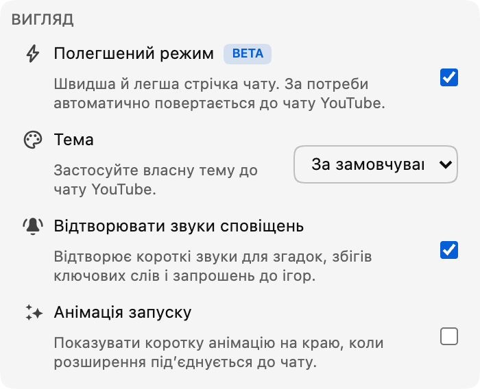

*Режим Lite тепер доступний у бета-версії, починаючи з версії 0.18.*

Активний прямий чат може бути однією з найкращих частин трансляції. Водночас він може сильно навантажувати браузер, коли повідомлення, аватари, значки, анімації та інші елементи чату накопичуються протягом тривалого часу.

Режим Lite пропонує інший варіант: меншу й легшу стрічку повідомлень, створену так, щоб залишатися швидкою навіть тоді, коли чат переповнений.

## Що змінює режим Lite

Режим Lite замінює лише прокручувану стрічку повідомлень. Відео, заголовок чату, поле повідомлення, вибір емодзі, вибір чату, налаштування та подання «Учасники» і далі належать YouTube.

Коли режим Lite увімкнено, Chat Enhancer замінює оригінальну стрічку власною полегшеною версією. Завдяки цьому одночасно активними залишаються менше елементів чату, зображень і ефектів, що підвищує продуктивність.

Найпомітнішим покращення має бути у швидких чатах або під час тривалих сеансів перегляду. Точна різниця все одно залежить від трансляції, вашого пристрою, інших розширень і ввімкнених функцій. Режим Lite зосереджується на стрічці чату; він не змінює обсяг роботи, потрібний для відтворення самого відео.

## Знайомий чат, легший усередині

Повідомлення зберігають знайоме оформлення в стилі YouTube, зокрема аватари, імена користувачів, значки модератора та підтвердженого облікового запису, часові позначки, власні емодзі, членство, подарунки й платні повідомлення.

Функції Chat Enhancer також продовжують працювати в полегшених рядках. Це включає переклад, виділення Inbox, профілі користувачів і нещодавні повідомлення, режим Focus, закладки, дії з повідомленнями, теми та підтримувані поверхні Playground.

Деякі функції YouTube можуть ще не підтримуватися в режимі Lite, наприклад можливість поскаржитися на учасника чату або заблокувати його. Підтримка цих функцій з’явиться в майбутніх оновленнях розширення. Ми продовжимо оновлювати режим Lite у міру появи нових можливостей YouTube.

:::media-right

{width=95%;rotate=-4.5deg}

## Як його ввімкнути
Увімкніть **режим Lite** у розділі **Вигляд** спливного вікна розширення. Для швидкого перемикання також можна скористатися кнопкою з блискавкою в заголовку чату.

:::

## Безпечне повернення до чату YouTube

YouTube із часом змінює формати чату, а прямі трансляції можуть містити незвичайні типи повідомлень або стани підключення. Якщо режим Lite не зможе далі читати основну стрічку чату, перестане отримувати оновлення або втратить потрібну частину сторінки, Chat Enhancer перезавантажить панель чату й автоматично відновить чат YouTube.

Ви побачите коротке сповіщення про те, що чат YouTube відновлено. Відео й решта сторінки перегляду не перезавантажуються.

Сам режим Lite не додає інший обліковий запис чату й не надсилає повідомлення через окремий сервіс чату. Читання й надсилання повідомлень і далі відбуваються через YouTube. Якщо ввімкнено переклад або Playground, ці функції зберігають ту саму мережеву поведінку, яку описано в нашій [політиці конфіденційності](/privacy/).

## Чому позначка «бета»?

Полегшена стрічка вже охоплює повсякденний досвід користування чатом, але деталі важливі. Ми плануємо й надалі налаштовувати темп повідомлень, прокручування, переходи у повторах, оформлення, обмеження продуктивності та підтримку нових форматів повідомлень YouTube, дізнаючись більше про роботу режиму Lite в різних трансляціях і на різних пристроях. Саме тому перемикач має значок **Бета**. Функцію вже можна випробувати, але вона ще змінюватиметься.

Якщо щось працює не так, повідомте нам, що ви помітили, за адресою [hello@chatenhancer.com](mailto:hello@chatenhancer.com). Особливо корисними будуть посилання на трансляцію, інформація про те, чи була вона прямою або повтором, і опис того, що сталося перед проблемою.
