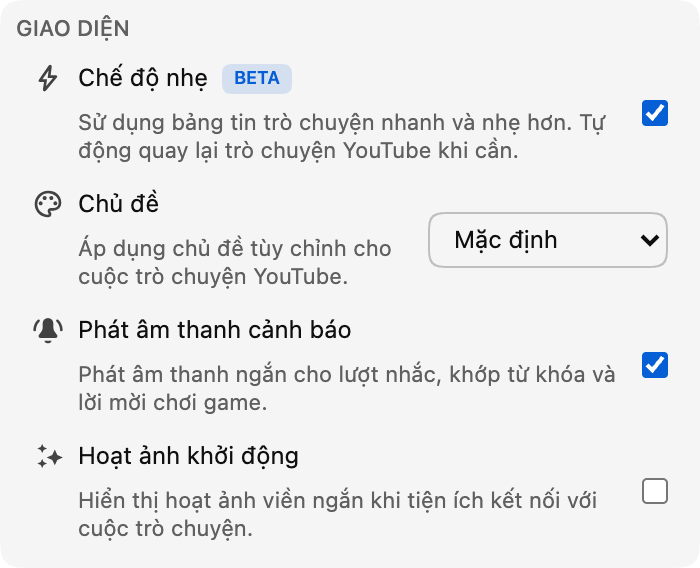

*Chế độ Lite hiện đã có bản beta trong phiên bản 0.18.*

Một cuộc trò chuyện trực tiếp sôi động có thể là một trong những phần hấp dẫn nhất của buổi phát. Tuy nhiên, nó cũng có thể khiến trình duyệt phải xử lý rất nhiều khi tin nhắn, ảnh đại diện, huy hiệu, hoạt ảnh và các thành phần trò chuyện khác tích tụ trong một thời gian dài.

Chế độ Lite mang đến một lựa chọn khác: bảng tin nhắn nhỏ và nhẹ hơn, được thiết kế để vẫn phản hồi nhanh khi cuộc trò chuyện trở nên đông đúc.

## Chế độ Lite thay đổi những gì

Chế độ Lite chỉ thay thế bảng tin nhắn có thể cuộn. Video, tiêu đề trò chuyện, hộp tin nhắn, bộ chọn biểu tượng cảm xúc, lựa chọn cuộc trò chuyện, phần cài đặt và chế độ xem Người tham gia vẫn thuộc về YouTube.

Khi chế độ Lite được bật, Chat Enhancer thay thế bảng tin gốc bằng phiên bản nhẹ của riêng mình. Nhờ đó, số thành phần trò chuyện, hình ảnh và hiệu ứng cần hoạt động cùng lúc sẽ ít hơn, giúp cải thiện hiệu suất.

Mức cải thiện lớn nhất sẽ dễ nhận thấy trong các cuộc trò chuyện chạy nhanh hoặc những phiên xem kéo dài. Mức chênh lệch cụ thể vẫn phụ thuộc vào buổi phát, thiết bị, các tiện ích mở rộng khác và những tính năng bạn đã bật. Chế độ Lite tập trung vào bảng tin trò chuyện; tính năng này không thay đổi lượng xử lý cần thiết để phát chính video.

## Giao diện trò chuyện quen thuộc, nhẹ hơn bên trong

Tin nhắn vẫn giữ bố cục quen thuộc theo phong cách YouTube, bao gồm ảnh đại diện, tên người dùng, huy hiệu người kiểm duyệt và huy hiệu đã xác minh, dấu thời gian, biểu tượng cảm xúc tùy chỉnh, tư cách thành viên, quà tặng và tin nhắn trả phí.

Các tính năng của Chat Enhancer cũng tiếp tục hoạt động trên những hàng nhẹ. Các tính năng đó gồm bản dịch, phần đánh dấu Inbox, hồ sơ người dùng và tin nhắn gần đây, chế độ Focus, dấu trang, thao tác với tin nhắn, chủ đề và các bề mặt Playground được hỗ trợ.

Một số tính năng của YouTube có thể chưa được hỗ trợ trong chế độ Lite, chẳng hạn như khả năng báo cáo hoặc chặn một người trong cuộc trò chuyện. Các tính năng này sẽ được chế độ Lite hỗ trợ trong những bản cập nhật tiện ích mở rộng sau này. Chúng tôi sẽ tiếp tục cập nhật chế độ Lite khi YouTube giới thiệu thêm tính năng.

:::media-right

{width=95%;rotate=-4.5deg}

## Cách bật
Bật **chế độ Lite** trong phần **Giao diện** của cửa sổ bật lên của tiện ích mở rộng. Bạn cũng có thể dùng nút hình tia chớp trong tiêu đề trò chuyện khi muốn chuyển đổi nhanh.

:::

## Cách an toàn để quay lại cuộc trò chuyện YouTube

YouTube thay đổi định dạng trò chuyện theo thời gian, và các buổi phát trực tiếp có thể chứa loại tin nhắn hoặc trạng thái kết nối bất thường. Nếu chế độ Lite không thể tiếp tục đọc bảng tin trò chuyện chính, ngừng nhận cập nhật hoặc mất phần trang mà nó cần, Chat Enhancer sẽ tải lại bảng trò chuyện và tự động khôi phục cuộc trò chuyện YouTube.

Bạn sẽ thấy một thông báo ngắn cho biết cuộc trò chuyện YouTube đã được khôi phục. Video và phần còn lại của trang xem sẽ không bị tải lại.

Bản thân chế độ Lite không thêm một tài khoản trò chuyện khác và không gửi tin nhắn qua một dịch vụ trò chuyện riêng. Việc đọc và gửi tin nhắn vẫn sử dụng YouTube. Nếu bạn bật tính năng dịch hoặc Playground, các tính năng đó vẫn giữ nguyên hành vi mạng được mô tả trong [chính sách quyền riêng tư](/privacy/) của chúng tôi.

## Tại sao có nhãn beta?

Bảng tin nhẹ đã đáp ứng trải nghiệm trò chuyện hằng ngày, nhưng các chi tiết vẫn rất quan trọng. Chúng tôi dự kiến tiếp tục điều chỉnh nhịp hiển thị tin nhắn, thao tác cuộn, chuyển cảnh khi phát lại, kiểu trình bày, giới hạn hiệu suất và khả năng hỗ trợ các định dạng tin nhắn YouTube mới khi tìm hiểu cách chế độ Lite hoạt động trên nhiều buổi phát và thiết bị hơn. Đó là lý do nút chuyển có huy hiệu **Beta**. Tính năng đã sẵn sàng để dùng thử, nhưng vẫn sẽ tiếp tục thay đổi.

Nếu có điều gì không ổn, hãy cho chúng tôi biết bạn đã quan sát thấy gì tại [hello@chatenhancer.com](mailto:hello@chatenhancer.com). Liên kết buổi phát, thông tin đó là phát trực tiếp hay bản phát lại và những gì xảy ra trước sự cố sẽ đặc biệt hữu ích.
