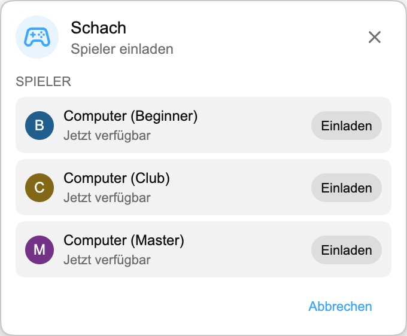

## Playground ist da

Playground ist ein kleiner Spielebereich in Chat Enhancer. Dort kannst du mit anderen Zuschauern spielen, die die Erweiterung installiert haben und gerade im selben Stream sind.

:::media-right

{shadow=smooth rotation=-2}

Die Spiele bleiben kompakt. Das Panel lässt sich verschieben, damit du es aus dem Weg ziehen kannst, sobald der Chat wieder anzieht.

:::

## So funktioniert Schach

Öffne das Spiele-Panel, wähle **Schach** und lade jemanden ein, der im selben Stream verfügbar ist. Wenn die Person annimmt, öffnet sich das Brett in einem kleinen, schwebenden Panel über dem Livechat.

Gespielt wird nach normalen Schachregeln. Züge werden geprüft, bevor sie gesendet werden, die Runden bleiben bei beiden Spielern synchron, und die Partie kann mit Schachmatt, Remis oder Aufgabe enden. Wenn der Stream wieder spannender wird, ziehst du das Panel einfach zur Seite und schaust weiter.

Wenn gerade niemand anderes da ist, unterstützt Schach auch Computer-Gegner. Wähle **Computer (Beginner)**, **Computer (Club)** oder **Computer (Master)** aus der Spielerliste und starte die Partie genauso wie mit einem anderen Zuschauer.

## Warum es in den Livechat gehört

Playground ist kein vollständiger Spielraum, der nachträglich an YouTube angeklebt wurde. Es ist für die ruhigen Phasen eines Streams gedacht, wenn der Chat noch offen ist, aber gerade nicht viel passiert. Deshalb bleibt Schach bewusst klein:

- Es nutzt ein kompaktes, verschiebbares Brett.
- Es zeigt nur verfügbare Spieler, die Chat Enhancer ebenfalls im aktuellen Stream verwenden.
- Der Rest von YouTube bleibt sichtbar, damit du sofort wieder zurück in den Chat kannst.

:::media-left

Aktiviere **Playground beitreten**, damit das Spiele-Symbol im Chat erscheint.

Aktiviere im Spiele-Panel **Für Einladungen verfügbar**, wenn andere Spieler dich sehen sollen. Wenn du meistens verfügbar sein möchtest, aktiviere in den Erweiterungseinstellungen **Standardmäßig für Einladungen verfügbar**.

:::

## Inzwischen mehr als Schach

Seit dieser ersten Schach-Vorschau ist Playground gewachsen. Du kannst auch [HELP-A-FRIEND! Trivia](/de/blog/new-in-0-14-0-help-a-friend-trivia/) spielen, und [The Wild Wild Chat](/de/blog/the-wild-wild-chat-coming-to-chat-enhancer-0-15-0/) macht aus dem Livechat eine schnelle Kopfgeldjagd.

Wenn du Vorschläge hast, kannst du uns unter [hello@chatenhancer.com](mailto:hello@chatenhancer.com) schreiben.
