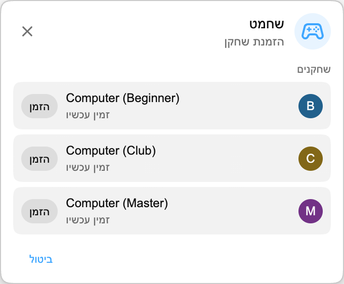

## Playground כאן

Playground הוא מרחב משחקים קטן בתוך Chat Enhancer. הוא מאפשר לשחק עם צופים אחרים שהתקינו את התוסף ונמצאים באותו שידור.

:::media-right

{shadow=smooth rotation=-2}

המשחקים נשארים קומפקטיים. אפשר לגרור את הפאנל, כך שאפשר להזיז אותו הצידה כשהצ'אט מתעורר שוב.

:::

## איך שחמט עובד

פתחו את פאנל המשחקים, בחרו **שחמט** והזמינו מישהו שזמין באותו שידור. כשההזמנה מתקבלת, הלוח נפתח בפאנל צף קטן מעל הצ'אט החי.

המשחק משתמש בחוקי שחמט רגילים. מהלכים נבדקים לפני שהם נשלחים, התור נשאר מסונכרן בין שני השחקנים, והמשחק יכול להסתיים במט, תיקו או כניעה. אם השידור שוב נהיה עמוס, גררו את הפאנל הצידה והמשיכו לצפות.

אם אין אף אחד אחר בסביבה, שחמט תומך גם ביריבי Computer. בחרו **Computer (Beginner)**, **Computer (Club)** או **Computer (Master)** מרשימת השחקנים והתחילו משחק כמו עם צופה אחר.

## למה זה שייך לצ'אט חי

Playground הוא לא חדר משחקים מלא שמודבק ל-YouTube. הוא נועד לרגעים השקטים של השידור, כשהצ'אט עדיין פתוח אבל לא קורה הרבה. לכן שחמט קטן בכוונה:

- הוא משתמש בלוח קומפקטי שאפשר להזיז.
- הוא מציג רק שחקנים זמינים שמשתמשים גם ב-Chat Enhancer בשידור הנוכחי.
- הוא משאיר את שאר YouTube גלוי, כדי שאפשר יהיה לחזור מיד לצ'אט.

:::media-left

הפעילו את **הצטרפות למגרש הניסויים** כדי שסמל המשחקים יופיע בצ'אט.

בתוך פאנל המשחקים, הפעילו **זמין למשחק** כשאתם רוצים ששחקנים אחרים יראו אתכם. אם בדרך כלל תרצו להיות זמינים, הפעילו **זמין כברירת מחדל** בהגדרות התוסף.

:::

## עכשיו זה יותר משחמט

Playground גדל מאז התצוגה המקדימה הראשונה הזו של שחמט. אפשר לשחק גם ב-[HELP-A-FRIEND! Trivia](/he/blog/new-in-0-14-0-help-a-friend-trivia/), ו-[The Wild Wild Chat](/he/blog/the-wild-wild-chat-coming-to-chat-enhancer-0-15-0/) הופך את הצ'אט החי לציד פרסים מהיר.

אם יש לכם הצעות, אפשר לשלוח לנו אימייל ל-[hello@chatenhancer.com](mailto:hello@chatenhancer.com).
