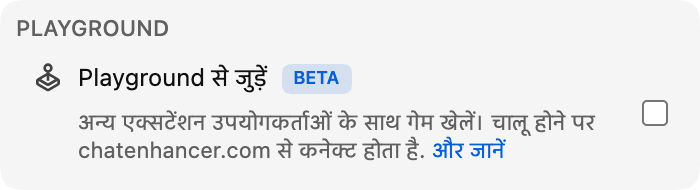

## Playground आ गया

Playground, Chat Enhancer के अंदर एक छोटा games hub है. इससे आप उसी stream में मौजूद उन viewers के साथ खेल सकते हैं जिनके पास extension installed है.

:::media-right

{shadow=smooth rotation=-2}

गेम compact रहते हैं. Panel को drag किया जा सकता है, इसलिए chat फिर तेज़ होने लगे तो आप उसे रास्ते से हटा सकते हैं.

:::

## शतरंज कैसे काम करता है

गेम पैनल खोलें, **शतरंज** चुनें, और उसी stream में available किसी व्यक्ति को invite करें. जब वह accept करेगा, board live chat के ऊपर एक छोटे floating panel में खुल जाएगा.

Game सामान्य chess rules पर चलता है. Moves भेजने से पहले check होते हैं, turns दोनों players के बीच synced रहते हैं, और match checkmate, draw या resignation से खत्म हो सकता है. Stream फिर busy हो जाए, तो panel को side में drag करें और देखते रहें.

अगर आसपास कोई और नहीं है, तो शतरंज में Computer opponents भी हैं. Player list से **Computer (Beginner)**, **Computer (Club)** या **Computer (Master)** चुनें और match वैसे ही शुरू करें जैसे किसी दूसरे viewer के साथ करते.

## यह live chat में क्यों फिट बैठता है

Playground कोई पूरा game room नहीं है जिसे YouTube पर चिपका दिया गया हो. यह stream के उन धीमे पलों के लिए है, जब chat खुला रहता है लेकिन बहुत कुछ नहीं हो रहा होता. इसलिए शतरंज को जानबूझकर छोटा रखा गया है:

- यह compact, movable board इस्तेमाल करता है.
- यह सिर्फ़ उन available players को दिखाता है जो current stream में Chat Enhancer इस्तेमाल कर रहे हैं.
- यह बाकी YouTube को visible रखता है, ताकि आप तुरंत chat में वापस लौट सकें.

:::media-left

Chat में गेम आइकन दिखाने के लिए **Playground से जुड़ें** enable करें.

गेम पैनल के अंदर, जब आप चाहते हैं कि दूसरे players आपको देखें, तो **आमंत्रणों के लिए उपलब्ध** on करें. अगर आप आम तौर पर available रहना चाहते हैं, तो extension settings में **डिफ़ॉल्ट रूप से आमंत्रणों के लिए उपलब्ध** on करें.

:::

## अब यह सिर्फ़ शतरंज नहीं है

इस पहली शतरंज preview के बाद Playground और बढ़ा है. अब आप [HELP-A-FRIEND! Trivia](/hi/blog/new-in-0-14-0-help-a-friend-trivia/) भी खेल सकते हैं, और [The Wild Wild Chat](/hi/blog/the-wild-wild-chat-coming-to-chat-enhancer-0-15-0/) live chat को तेज़ bounty hunt में बदल देता है.

अगर आपके पास सुझाव हैं, तो हमें [hello@chatenhancer.com](mailto:hello@chatenhancer.com) पर email करें.
