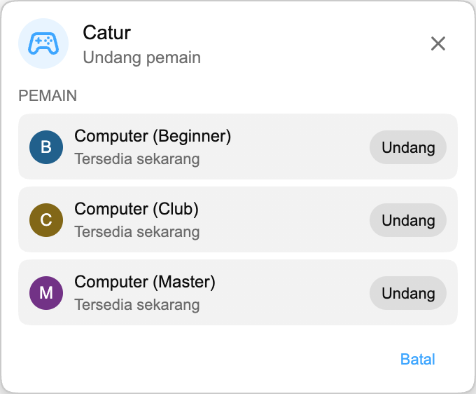

## Playground sudah hadir

Playground adalah hub game kecil di dalam Chat Enhancer. Anda bisa bermain dengan penonton lain yang memasang ekstensi dan sedang berada di stream yang sama.

:::media-right

{shadow=smooth rotation=-2}

Game tetap ringkas. Panelnya bisa diseret, jadi Anda dapat memindahkannya saat chat kembali ramai.

:::

## Cara kerja Catur

Buka panel Game, pilih **Catur**, lalu undang seseorang yang tersedia di stream yang sama. Saat mereka menerima, papan akan terbuka dalam panel kecil yang melayang di atas live chat.

Game ini memakai aturan chess biasa. Langkah diperiksa sebelum dikirim, giliran tetap sinkron antara kedua pemain, dan pertandingan bisa berakhir dengan checkmate, draw, atau resign. Jika stream kembali ramai, seret panel ke samping dan lanjutkan menonton.

Jika tidak ada orang lain di sekitar, Catur juga mendukung lawan Computer. Pilih **Computer (Beginner)**, **Computer (Club)**, atau **Computer (Master)** dari daftar pemain dan mulai pertandingan seperti saat bermain dengan penonton lain.

## Kenapa cocok di live chat

Playground bukan ruang game penuh yang ditempelkan ke YouTube. Fitur ini dibuat untuk bagian stream yang lebih tenang, saat chat masih terbuka tetapi tidak banyak yang terjadi. Itu sebabnya Catur sengaja dibuat kecil:

- Menggunakan papan yang ringkas dan bisa dipindahkan.
- Hanya menampilkan pemain tersedia yang juga memakai Chat Enhancer di stream saat ini.
- Menjaga bagian YouTube lainnya tetap terlihat, sehingga Anda bisa langsung kembali ke chat.

:::media-left

Aktifkan **Gabung Playground** agar ikon Game muncul di chat.

Di dalam panel Game, aktifkan **Tersedia untuk undangan** saat Anda ingin pemain lain melihat Anda. Jika biasanya ingin selalu tersedia, aktifkan **Tersedia untuk undangan secara default** di pengaturan ekstensi.

:::

## Sekarang bukan cuma Catur

Playground sudah berkembang sejak pratinjau Catur pertama ini. Anda juga bisa memainkan [HELP-A-FRIEND! Trivia](/id/blog/new-in-0-14-0-help-a-friend-trivia/), dan [The Wild Wild Chat](/id/blog/the-wild-wild-chat-coming-to-chat-enhancer-0-15-0/) mengubah live chat menjadi perburuan bounty yang cepat.

Jika punya saran, Anda bisa mengirim email ke [hello@chatenhancer.com](mailto:hello@chatenhancer.com).
