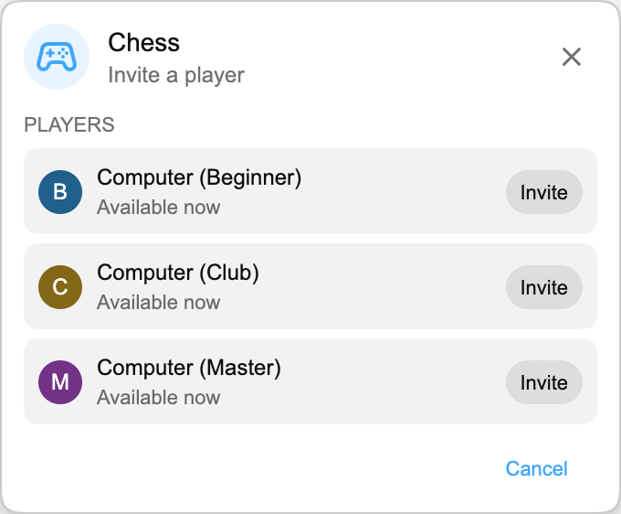

## Playground is here

Playground is a small games hub inside Chat Enhancer for quick matches with other viewers in the same stream.

:::media-right

{shadow=smooth rotation=-2}

Games use a compact, draggable panel that stays near chat without taking over the page.

:::

## How Chess works

Open the Games panel, pick **Chess**, and invite someone available in the same stream. When they accept, the board opens in a small floating panel over live chat.

Moves follow normal chess rules, turns stay synced, and the match can end by checkmate, draw, or resignation.

If nobody else is available, choose **Computer (Beginner)**, **Computer (Club)**, or **Computer (Master)** from the player list.

## Why it belongs in live chat

Playground is designed for quiet moments in a stream, so it keeps YouTube visible:

- It uses a compact, movable board.
- It only shows available players who are also using Chat Enhancer in the current stream.
- You can return to chat immediately.

:::media-left

Enable **Join Playground** for the Games icon to appear in chat.

Inside the Games panel, turn on **Available for games** when you want other players to see you. If you usually want to be available, turn on **Available by default** in the extension settings.

:::

## More than Chess now

Playground has grown since this first Chess preview. You can also play [HELP-A-FRIEND! Trivia](/blog/new-in-0-14-0-help-a-friend-trivia/), while [The Wild Wild Chat](/blog/the-wild-wild-chat-coming-to-chat-enhancer-0-15-0/) turns live chat into a fast bounty hunt.

If you have any suggestions, you can email us at [hello@chatenhancer.com](mailto:hello@chatenhancer.com).
