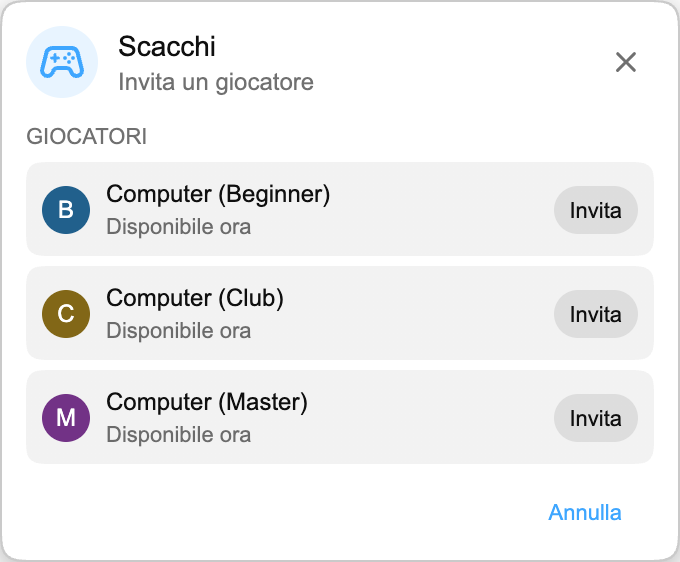

## Playground è arrivato

Playground è un piccolo spazio giochi dentro Chat Enhancer. Ti permette di giocare con altri spettatori che hanno l’estensione installata e stanno guardando lo stesso stream.

:::media-right

{shadow=smooth rotation=-2}

I giochi restano compatti. Il pannello si può trascinare, così puoi spostarlo quando la chat riprende ritmo.

:::

## Come funziona Scacchi

Apri il pannello Giochi, scegli **Scacchi** e invita qualcuno disponibile nello stesso stream. Quando accetta, la scacchiera si apre in un piccolo pannello flottante sopra la live chat.

Il gioco usa le regole normali degli scacchi. Le mosse vengono controllate prima dell’invio, i turni restano sincronizzati tra i due giocatori e la partita può finire per scacco matto, patta o resa. Se lo stream torna movimentato, trascina il pannello di lato e continua a guardare.

Se non c’è nessun altro, Scacchi supporta anche avversari Computer. Scegli **Computer (Beginner)**, **Computer (Club)** o **Computer (Master)** dall’elenco dei giocatori e avvia la partita come faresti con un altro spettatore.

## Perché appartiene alla live chat

Playground non è una sala giochi completa agganciata a YouTube. Esiste per i momenti lenti di uno stream, quando la chat è ancora aperta ma non succede molto. Per questo Scacchi è volutamente piccolo:

- Usa una scacchiera compatta e spostabile.
- Mostra solo giocatori disponibili che stanno usando Chat Enhancer nello stream attuale.
- Mantiene visibile il resto di YouTube, così puoi tornare subito alla chat.

:::media-left

Attiva **Partecipa a Playground** per far comparire l’icona Giochi nella chat.

Nel pannello Giochi, attiva **Disponibile agli inviti** quando vuoi che gli altri giocatori ti vedano. Se di solito vuoi risultare disponibile, attiva **Disponibile agli inviti di default** nelle impostazioni dell’estensione.

:::

## Ora è più di Scacchi

Playground è cresciuto da questa prima anteprima di Scacchi. Ora puoi giocare anche a [HELP-A-FRIEND! Trivia](/it/blog/new-in-0-14-0-help-a-friend-trivia/), e [The Wild Wild Chat](/it/blog/the-wild-wild-chat-coming-to-chat-enhancer-0-15-0/) trasforma la live chat in una veloce caccia alle taglie.

Se hai suggerimenti, puoi scriverci a [hello@chatenhancer.com](mailto:hello@chatenhancer.com).
