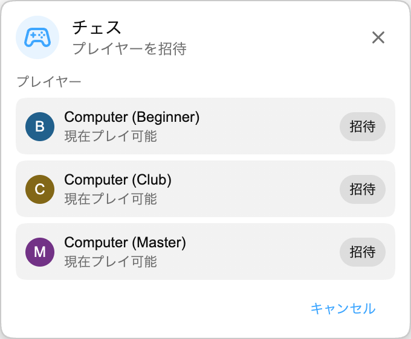

## Playground が登場

Playground は、Chat Enhancer の中にある小さなゲームハブです。同じ配信にいて、拡張機能を入れている視聴者同士で遊べます。

:::media-right

{shadow=smooth rotation=-2}

ゲームは場所を取りません。パネルはドラッグできるので、チャットがまた忙しくなったら邪魔にならない位置へ動かせます。

:::

## チェスの遊び方

ゲームパネルを開き、**チェス** を選んで、同じ配信で参加可能な人を招待します。相手が承諾すると、ライブチャットの上に小さなフローティングパネルで盤面が開きます。

ゲームは通常のチェスルールで進みます。手は送信前にチェックされ、双方のターンは同期され、対局はチェックメイト、引き分け、投了で終了します。配信がまた忙しくなったら、パネルを横にドラッグしてそのまま視聴を続けられます。

ほかに相手がいない場合、チェスでは Computer とも対戦できます。プレイヤー一覧から **Computer (Beginner)**、**Computer (Club)**、または **Computer (Master)** を選び、ほかの視聴者と同じ流れで対局を始めます。

## ライブチャットに合う理由

Playground は、YouTube に無理やり追加した本格ゲームルームではありません。チャットは開いているけれど動きが少ない、そんな配信中のゆるい時間のためのものです。 だからチェスは、あえて小さく作っています。

- コンパクトで移動できる盤面を使います。
- 現在の配信で Chat Enhancer を使っている、参加可能なプレイヤーだけを表示します。
- YouTube のほかの部分を表示したままにするので、すぐチャットに戻れます。

:::media-left

チャットにゲームアイコンを表示するには、**Playground に参加**を有効にします。

ゲームパネル内で、他のプレイヤーに自分を表示したいときは **プレイ可能** をオンにします。いつも参加可能にしておきたい場合は、拡張機能の設定で **デフォルトでプレイ可能** をオンにします。

:::

## 今はチェスだけではありません

Playground は、この最初のチェスプレビューから広がってきました。[HELP-A-FRIEND! Trivia](/ja/blog/new-in-0-14-0-help-a-friend-trivia/) も遊べますし、[The Wild Wild Chat](/ja/blog/the-wild-wild-chat-coming-to-chat-enhancer-0-15-0/) はライブチャットをスピード感のある Bounty Hunting に変えます。

提案があれば [hello@chatenhancer.com](mailto:hello@chatenhancer.com) までメールしてください。
