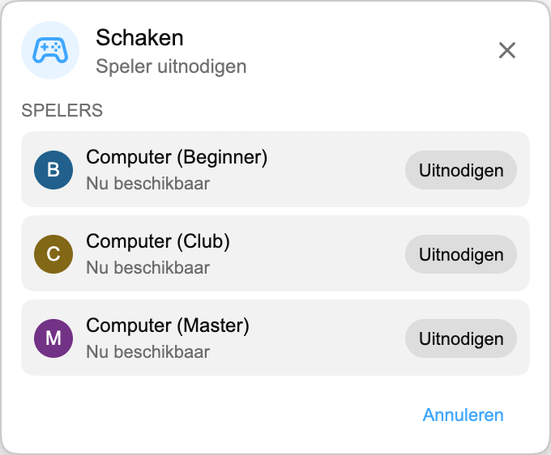

## Playground is er

Playground is een kleine gamehub in Chat Enhancer. Je kunt er spelen met andere kijkers die de extensie hebben geïnstalleerd en in dezelfde stream zitten.

:::media-right

{shadow=smooth rotation=-2}

Games blijven compact. Het paneel is versleepbaar, zodat je het aan de kant kunt zetten zodra de chat weer drukker wordt.

:::

## Hoe Schaken werkt

Open het Games-paneel, kies **Schaken** en nodig iemand uit die beschikbaar is in dezelfde stream. Zodra die persoon accepteert, opent het bord in een klein zwevend paneel boven de livechat.

De game gebruikt normale schaakregels. Zetten worden gecontroleerd voordat ze worden verstuurd, beurten blijven bij beide spelers synchroon en de match kan eindigen met schaakmat, remise of opgave. Wordt de stream weer druk, dan sleep je het paneel opzij en kijk je verder.

Als er niemand anders in de buurt is, ondersteunt Schaken ook Computer-tegenstanders. Kies **Computer (Beginner)**, **Computer (Club)** of **Computer (Master)** uit de spelerslijst en start een match zoals je dat met een andere kijker zou doen.

## Waarom dit in livechat past

Playground is geen volledige gameroom die op YouTube is geplakt. Het is bedoeld voor de rustige stukken van een stream, wanneer de chat nog open is maar er niet veel gebeurt. Daarom blijft Schaken bewust klein:

- Het gebruikt een compact, verplaatsbaar bord.
- Het toont alleen beschikbare spelers die ook Chat Enhancer gebruiken in de huidige stream.
- De rest van YouTube blijft zichtbaar, zodat je meteen terug kunt naar de chat.

:::media-left

Schakel **Deelnemen aan Playground** in om het Games-pictogram in de chat te laten verschijnen.

Zet in het Games-paneel **Beschikbaar voor uitnodigingen** aan wanneer je wilt dat andere spelers je zien. Als je meestal beschikbaar wilt zijn, schakel je **Standaard beschikbaar voor uitnodigingen** in bij de extensie-instellingen.

:::

## Inmiddels meer dan Schaken

Playground is gegroeid sinds deze eerste schaakpreview. Je kunt ook [HELP-A-FRIEND! Trivia](/nl/blog/new-in-0-14-0-help-a-friend-trivia/) spelen, en [The Wild Wild Chat](/nl/blog/the-wild-wild-chat-coming-to-chat-enhancer-0-15-0/) verandert livechat in een snelle bountyjacht.

Als je suggesties hebt, kun je mailen naar [hello@chatenhancer.com](mailto:hello@chatenhancer.com).
