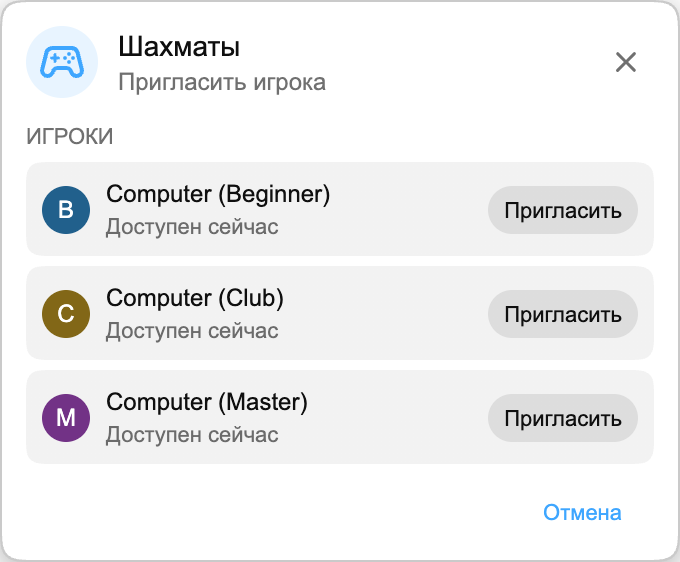

## Playground уже здесь

Playground — небольшой игровой раздел внутри Chat Enhancer. В нём можно играть с другими зрителями, у которых установлено расширение и открыт тот же стрим.

:::media-right

{shadow=smooth rotation=-2}

Игры остаются компактными. Панель можно перетаскивать, поэтому её легко убрать в сторону, когда чат снова оживится.

:::

## Как работают «Шахматы»

Откройте панель «Игры», выберите **Шахматы** и пригласите доступного участника того же стрима. Когда он примет приглашение, доска откроется в небольшой плавающей панели поверх live chat.

Игра использует обычные шахматные правила. Ходы проверяются перед отправкой, очередность синхронизируется у обоих игроков, а партия может закончиться матом, ничьей или сдачей. Если стрим снова станет активным, перетащите панель в сторону и продолжайте смотреть.

Если рядом никого нет, в «Шахматах» также можно играть против Computer. Выберите **Computer (Beginner)**, **Computer (Club)** или **Computer (Master)** из списка игроков и начните партию так же, как с другим зрителем.

## Почему это подходит live chat

Playground — не полноценная игровая комната, прикрученная к YouTube. Он нужен для спокойных моментов стрима, когда чат открыт, но почти ничего не происходит. Поэтому «Шахматы» намеренно компактны:

- Использует компактную, перемещаемую доску.
- Показывает только доступных игроков, которые тоже используют Chat Enhancer в текущем стриме.
- Оставляет остальной YouTube видимым, чтобы вы могли сразу вернуться к чату.

:::media-left

Включите **Присоединиться к Playground**, чтобы в чате появился значок «Игры».

В панели «Игры» включите **Доступен для приглашений**, когда хотите, чтобы другие игроки вас видели. Если обычно вы хотите быть доступным, включите **Доступен для приглашений по умолчанию** в настройках расширения.

:::

## Теперь это больше, чем «Шахматы»

Playground вырос после этой первой демонстрации «Шахмат». Теперь можно играть и в [HELP-A-FRIEND! Trivia](/ru/blog/new-in-0-14-0-help-a-friend-trivia/), а [The Wild Wild Chat](/ru/blog/the-wild-wild-chat-coming-to-chat-enhancer-0-15-0/) превращает live chat в быструю охоту за наградами.

Если у вас есть предложения, напишите нам на [hello@chatenhancer.com](mailto:hello@chatenhancer.com).
