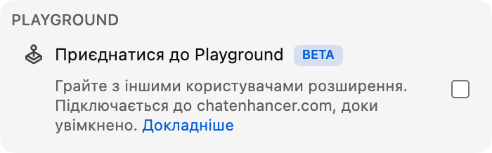

## Playground уже тут

Playground — це невеликий ігровий розділ у Chat Enhancer. У ньому можна грати з іншими глядачами, у яких установлене розширення й відкритий той самий стрим.

:::media-right

{shadow=smooth rotation=-2}

Ігри залишаються компактними. Панель можна перетягувати, тож її легко відсунути, коли чат знову оживе.

:::

## Як працюють «Шахи»

Відкрийте панель «Ігри», виберіть **Шахи** і запросіть когось доступного в тому самому стримі. Коли запрошення приймуть, дошка відкриється в невеликій плаваючій панелі над live chat.

Гра використовує звичайні шахові правила. Ходи перевіряються перед надсиланням, черга синхронізується в обох гравців, а партія може завершитися матом, нічиєю або здачею. Якщо стрим знову стане активним, перетягніть панель убік і продовжуйте дивитися.

Якщо поруч немає нікого іншого, у «Шахах» також можна грати проти Computer. Виберіть **Computer (Beginner)**, **Computer (Club)** або **Computer (Master)** зі списку гравців і почніть партію так само, як з іншим глядачем.

## Чому це пасує live chat

Playground — це не повноцінна ігрова кімната, прикручена до YouTube. Він створений для спокійних моментів стриму, коли чат відкритий, але майже нічого не відбувається. Тому «Шахи» навмисно компактні:

- Використовує компактну рухому дошку.
- Показує лише доступних гравців, які також використовують Chat Enhancer у поточному стримі.
- Залишає решту YouTube видимою, щоб можна було одразу повернутися до чату.

:::media-left

Увімкніть **Приєднатися до Playground**, щоб у чаті з’явилася іконку «Ігри».

На панелі «Ігри» увімкніть **Доступний для запрошень**, коли хочете, щоб інші гравці бачили вас. Якщо зазвичай хочете бути доступними, увімкніть **Доступний для запрошень за замовчуванням** у налаштуваннях розширення.

:::

## Тепер це більше, ніж «Шахи»

Playground виріс після цієї першої демонстрації «Шахів». Ви також можете грати в [HELP-A-FRIEND! Trivia](/uk/blog/new-in-0-14-0-help-a-friend-trivia/), а [The Wild Wild Chat](/uk/blog/the-wild-wild-chat-coming-to-chat-enhancer-0-15-0/) перетворює live chat на швидке полювання за винагородами.

Якщо маєте пропозиції, напишіть нам на [hello@chatenhancer.com](mailto:hello@chatenhancer.com).
