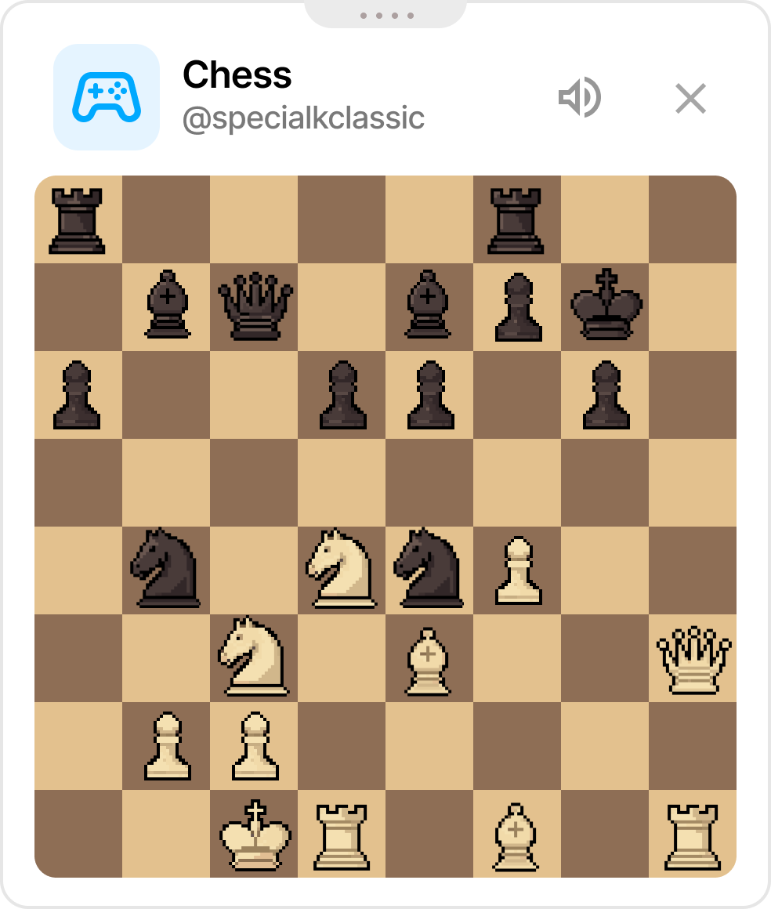
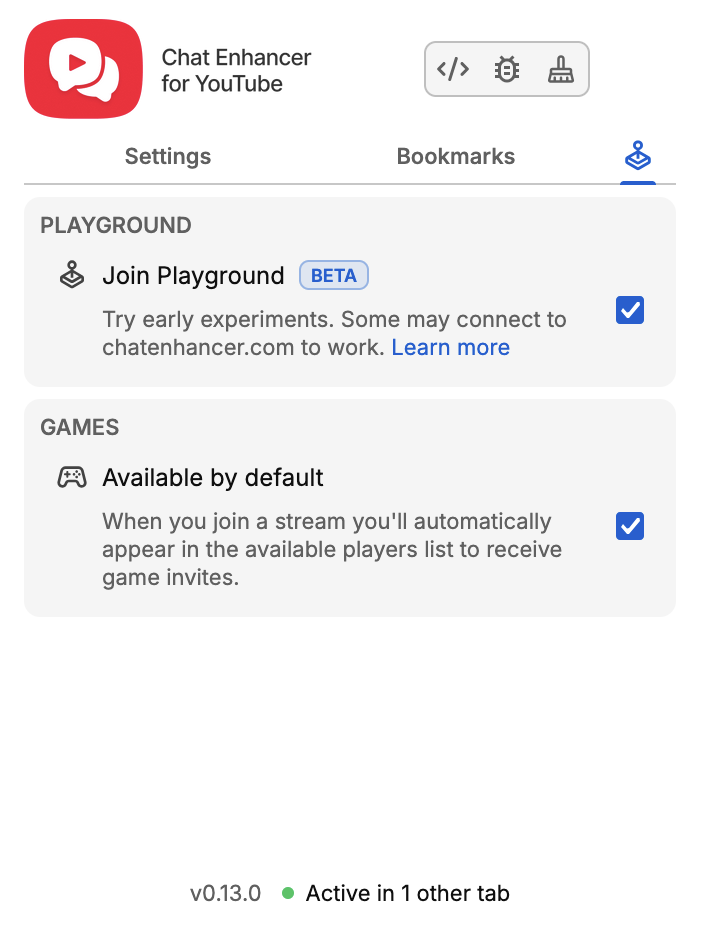

## Playground đã có mặt!

Playground là một trung tâm trò chơi nằm trong tiện ích, nơi bạn có thể chơi với những người dùng khác cũng đã cài tiện ích.

Streamer của bạn đang nghỉ một chút? Mở Playground cho đến khi họ quay lại.

:::media-right

{shadow=smooth rotation=-2}

Các trò chơi được làm nhỏ gọn và sẽ không lớn hơn hình này nhiều. Bảng có thể kéo thả, nên bạn có thể đặt nó ở bất cứ đâu trong chat.

Trò chơi đầu tiên là cờ vua quen thuộc. Bạn có thể chiếu hết người bạn stream mới của mình nhanh đến đâu?

:::

Tìm các tùy chọn Playground trong phần cài đặt tiện ích này.

:::media-left

{crop=1.04;focus=26.3%,0%;rotate=0.5deg}

Bật cài đặt “Tham gia Playground” để biểu tượng Trò chơi xuất hiện trong chat.

Khi mở bảng Trò chơi, bạn sẽ cần bật “Có sẵn để chơi” để người chơi khác thấy bạn, hoặc bật “Có sẵn theo mặc định” trong cài đặt tiện ích để nó luôn bật. Tùy bạn chọn.

:::

Sẽ có thêm trò chơi trong thời gian tới!

Nếu có gợi ý, bạn có thể gửi email cho chúng tôi tại [hello@chatenhancer.com](mailto:hello@chatenhancer.com).
