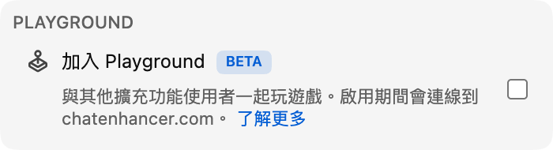

## Playground 登場

Playground 是 Chat Enhancer 裡的小型遊戲中心。你可以和同樣安裝擴充功能、並且在同一場直播裡的其他觀眾一起玩。

:::media-right

{shadow=smooth rotation=-2}

遊戲面板保持精簡，可以拖曳。聊天室又熱鬧起來時，你可以把它移到旁邊。

:::

## 西洋棋如何運作

打開遊戲面板，選擇 **西洋棋**，然後邀請同一場直播裡可邀請的觀眾。對方接受後，棋盤會在直播聊天室上方的小型浮動面板中打開。

遊戲使用標準西洋棋規則。走棋會在送出前檢查，雙方回合同步，棋局可以用將死、和棋或認輸結束。如果直播又忙起來，把面板拖到旁邊繼續看就行。

如果周圍沒有其他人，西洋棋也支援 Computer 對手。你可以從玩家清單中選擇 **Computer (Beginner)**、**Computer (Club)** 或 **Computer (Master)**，像邀請其他觀眾一樣開始一局。

## 為什麼它屬於直播聊天

Playground 不是硬塞進 YouTube 的完整遊戲房間。它是為直播裡節奏放慢的時刻準備的：聊天室還開著，但暫時沒太多事情發生。 所以西洋棋有意保持小巧：

- 它使用精簡、可拖曳的棋盤。
- 它只顯示目前直播裡同樣使用 Chat Enhancer 的可用玩家。
- 它讓 YouTube 其他部分保持可見，方便你隨時回到聊天室。

:::media-left

啟用 **加入 Playground** 後，遊戲 圖示就會出現在聊天室中。

在遊戲面板裡，想讓其他玩家看到你時，開啟 **可接收邀請**。如果你通常都願意被邀請，請在擴充功能設定中開啟 **預設可接收邀請**。

:::

## 現在不只有西洋棋

自從這篇最初的西洋棋預覽之後，Playground 已經繼續擴展。你也可以玩 [HELP-A-FRIEND! Trivia](/zh-TW/blog/new-in-0-14-0-help-a-friend-trivia/)，而 [The Wild Wild Chat](/zh-TW/blog/the-wild-wild-chat-coming-to-chat-enhancer-0-15-0/) 會把直播聊天室變成一場快節奏的 Bounty Hunting。

如果你有建議，可以寄信到 [hello@chatenhancer.com](mailto:hello@chatenhancer.com)。
