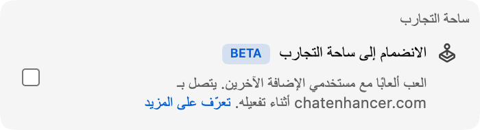

أصبح الدخول إلى Playground أسهل الآن: يمكنك اللعب ضد **Computer**.

## كيف يعمل

افتح Playground من لوحة الألعاب وابحث عن لاعب Computer في قائمة اللاعبين. ادعُ واحدًا منهم بالطريقة نفسها التي تدعو بها أي مشاهد آخر. تبدأ المباراة تلقائيًا، ويعمل باقي Playground بالطريقة نفسها.

يتوفر منافسو Computer في كل ألعاب Playground:

- **شطرنج**، مع **Computer (Beginner)** و**Computer (Club)** و**Computer (Master)** حتى تختار مباراة خفيفة أو متوسطة أو أصعب.
- **HELP-A-FRIEND! Trivia وThe Wild Wild Chat وStick Around!**، لكي تظل كل لعبة قابلة للعب عندما لا يتوفر أحد غيرك.

## كيف يلعب Computer

في شطرنج، ينتظر Computer قليلًا قبل أن يتحرك، حتى لا تبدو اللعبة فورية. أصبح لدى شطرنج الآن ثلاثة خصوم Computer. Beginner هو الخيار الأسهل للتسخين، وClub يقدم مباراة متوسطة أكثر ثباتًا، وMaster هو الخيار الأصعب.

في *HELP-A-FRIEND! Trivia*، يجيب Computer خلال كل جولة أسئلة ولا يصيب دائماً. وفي *The Wild Wild Chat*، يراقب الرسائل التي تطابق مكافأة مفتوحة ويحاول المطالبة بها قبلك. وفي *Stick Around!*، يتحرك في الحلبة ويتفادى فقاعات الدردشة المتساقطة ويقاتل ليكون آخر لاعب صامد.

## لماذا أضفناه؟

يكون Playground في أفضل حالاته عندما تجد شخصًا قريبًا تلعب معه، لكن الدردشة المباشرة لا يمكن توقعها دائمًا. يحافظ Computer على قابلية اللعب في اللحظات الأهدأ، أو البثوث المتأخرة، أو الإعادات، أو المجتمعات الصغيرة التي قد لا يتوفر فيها مستخدم آخر لـ Chat Enhancer.

:::media-left

يبقى Playground اختياريًا. فعّل **الانضمام إلى Playground** من إعدادات الإضافة، وافتح لوحة الألعاب في الدردشة، وادعُ خصمًا من Computer عندما تريد مباراة.

:::
